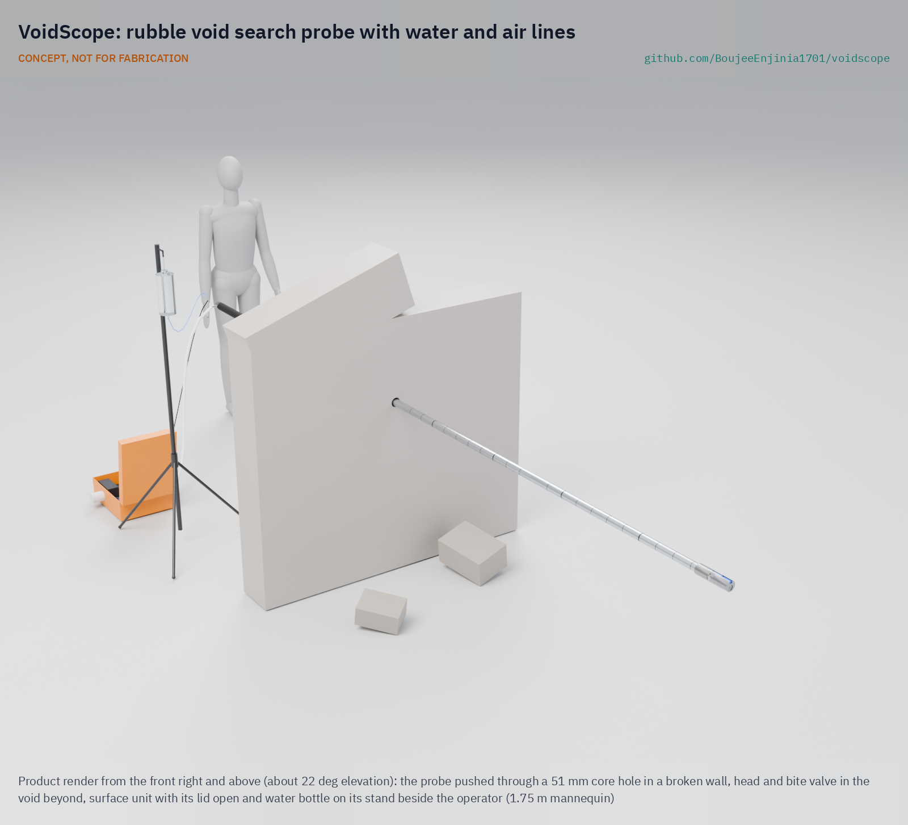
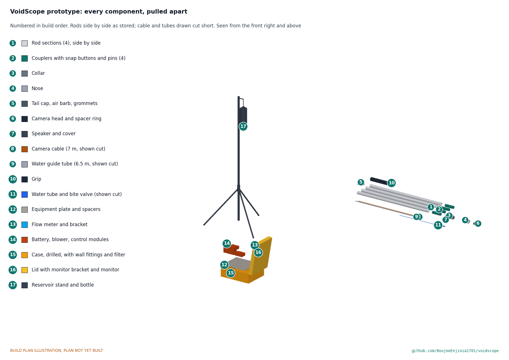

# VoidScope

     

**Area:** Situational field hardware · **TRL:** 3 of 9 (proof of concept on paper) · **Value-engineering target:** about $2,000 USD (estimated cost $1,780 USD) · **Difficulty:** 3 of 5

Searches rubble voids with a camera probe that also delivers water and air to a trapped survivor.

[Exploded render](media/render-exploded.png) · [Detail render](media/render-detail.png) · [Interactive 3D model](media/viewer.html) · [Concept blueprint (PDF)](media/concept-blueprint.pdf) · [General arrangement (PDF)](cad/drawings/VDS-DWG-001.pdf) · [Calculations](docs/04-calcs/01-sizing.md) · [Prototype build plan](docs/05-build-plan.md) · [Design decisions](docs/06-design-decisions.md) · [Review note](docs/REVIEW.md)

## Concept rationale

Most people pulled alive from collapsed buildings are found by local responders in the first day, with little equipment. A camera probe lets a crew look into a void through a small hole instead of opening it blind, and the same probe can then carry water and fresh air to the person it finds. One tool does both jobs, so a crew that has located a survivor does not have to break a second path in to supply them.

Keeping the design open and buildable from commodity parts matters because commercial search cameras sit in the tens of thousands of dollars. VoidScope is a documented push probe built from a bought sealed camera head, aluminium tube and turned aluminium parts, with the rod itself as the air duct and a single-use food-grade water line inside it. Its value-engineering target is $2,000 USD and the constructable design is estimated at $1,780 USD, so that municipal and volunteer teams can build, repair and train with it.

## Burning platform

Time decides who lives. More than 90 per cent of earthquake survivors are rescued within the first three days, most within 24 hours by local responders using minimal equipment, and international teams typically need more than 24 hours to arrive ([Gulf News, citing Ilan Kelman, UCL, 2023](https://gulfnews.com/world/mena/why-first-72-hours-are-crucial-for-turkey-syria-quake-rescues-1.1675864021699)). The same source notes that without water, trapped people start dying at the three to five day mark.

The tools that help crews see into voids are costly. A Leader Cam search camera lists at $17,562 USD ([Emergency Responder Products](https://emergencyresponderproducts.com/products/leader-cam)), and the Savox SearchCam 3000 kit weighs 18.6 kg (41 lb) in its case ([Savox datasheet](https://www.datocms-assets.com/120614/1756472896-savox-searchcam-3000-datasheet-2.pdf)). Neither delivers water or air. Where supplies do reach trapped people, it is by improvisation: at Rana Plaza, rescuers gave the survivor Reshma water, oxygen and saline while they cut her free ([Global News, 2013](https://globalnews.ca/news/550768/bangladesh-rescuers-find-survivor-in-rubble-17-days-after-collapse/)).

## Where it could be used

### By industry

| Industry | Use |
| --- | --- |
| Fire and rescue services | Hasty void search and survivor support by municipal crews without a funded USAR camera |
| Humanitarian and disaster response | Low-cost search kit for local and volunteer teams in the first 72 hours after an earthquake |
| Construction and demolition | Standby search tool on sites where structures under construction may collapse |
| Mining and tunnelling | Looking into collapsed drifts or rescue pipes and passing water and air to trapped workers |
| Training and education | Affordable training probe for USAR courses and community emergency response teams |

### By country or region

| Country or region | Why it matters there |
| --- | --- |
| Turkey and Syria | The February 2023 earthquakes killed more than 42,000 people, and one survivor was pulled out after 248 hours without food or water ([CNN, 2023](https://www.cnn.com/2023/02/16/europe/turkey-syria-earthquake-rescue-efforts-intl/index.html)). |
| Bangladesh | The Rana Plaza collapse in 2013 left more than 1,000 dead, and rescuers worked for more than two weeks to reach survivors in the basement ([IBTimes UK, 2013](https://www.ibtimes.co.uk/rana-plaza-disaster-woman-named-reshma-found-466613)). |
| Nigeria | When a 21-storey building under construction collapsed in Ikoyi, Lagos, in 2021, up to 100 people were feared trapped ([Al Jazeera, 2021](https://www.aljazeera.com/news/2021/11/1/lagos-building-collapses-several-killed)) and 42 bodies were eventually recovered ([VOA, 2021](https://www.voanews.com/a/death-toll-in-lagos-high-rise-building-collapse-rises-to-42-/6303343.html)). |
| Nepal | The 2015 magnitude 7.8 earthquake killed more than 1,300 people by the first day's reports, and survivors pulled from the rubble swamped hospitals in the capital ([NPR, 2015](https://www.npr.org/sections/thetwo-way/2015/04/25/402160910/7-8-quake-hits-nepal-toppling-buildings-killing-at-least-138)). |

## What sparked the idea

On 10 May 2013, seventeen days after the Rana Plaza building collapsed near Dhaka, rescuers heard a garment worker named Reshma tapping on the wreckage with a pipe. She had rationed a few bottles of water. While crews cut through rods and debris to free her, they passed her water, oxygen and saline ([Global News, 2013](https://globalnews.ca/news/550768/bangladesh-rescuers-find-survivor-in-rubble-17-days-after-collapse/)). Finding her took days of listening; supplying her took improvisation. VoidScope asks whether one simple probe could do both, sooner.

## Problem

After a building collapse, local crews reach most survivors first but rarely have search cameras, and those who find someone alive still need to keep them supplied while the dig goes on. Commercial search cameras cost more than many local teams can pay and do not deliver water or air.

Full problem statement: [docs/01-problem.md](docs/01-problem.md)

## Concept

A 4.5 m push probe, 48 mm across at its widest, that passes a standard 51 mm core hole; its camera tip bends up to 90° either way from a thumb lever to look around a bend. Four aluminium sections click together with snap buttons and stay threaded on the camera cable and a water guide tube, like the cord in a tent pole. A sealed 1080p camera with its own lights sits in the steerable tip; a small speaker for two-way talk and a bite valve sit in the turned aluminium head. A battery blower in the surface unit pushes filtered air down the rod's bore and out of six holes at the head, never above 0.9 kPa even when the tip is blocked; a gravity drip from a bottle on a stand reaches the bite valve through a capillary that caps the flow at 4.5 mL/min. The monitor and recorder sit in the lid of the surface unit.

Full design precis: [docs/02-concept.md](docs/02-concept.md) · Requirements: [docs/03-requirements.md](docs/03-requirements.md)

## Key components

- Camera head: bought IP68 pipe-inspection head, 29 mm, 1080p, 12 LEDs
- Head: turned aluminium collar (socket, air outlets, speaker, water exit) and nose (camera, bite valve pocket)
- Rod: four 1,050 mm sections of 38.1 mm aluminium tube with bonded couplers and snap buttons; depth bands every 100 mm
- Tail cap with the air inlet barb, and a grip
- Lines: camera and speaker cable; PTFE guide tube; single-use water set with capillary, roller clamp and bite valve
- Surface unit: IP67 case with LiFePO4 battery, blower, intake filter, flow meter, push-to-talk amplifier, and a 7 in monitor with recorder in the lid
- Water bottle on a light stand; rod carry case; cleaning kit and spare water sets

## Building the prototype

The design is constructable: every part can be cut, drilled, turned or bought, and every joint has a fixing, checked by 180 model checks. The [prototype build plan](docs/05-build-plan.md) takes a maker through fourteen made components and seventeen assembly steps, each with a picture, and lists the first checks and the safety stops. It is a plan, not yet built; building and testing to it is TRL 4 work. Decisions live in the [design decisions register](docs/06-design-decisions.md).

## Safety

> Safety-critical rescue equipment. Published as an open engineering reference, never as certified rescue equipment, and not a medical device. This is a TRL 3 concept, not for fabrication.
>
> Only trained rescue teams should use it, inside their own incident command and structural safety procedures. The operator never enters the void.
>
> Water can be inhaled by a survivor who is drowsy, injured or lying badly. Give water only under the direction of the team's medical lead, only to a conscious person who can drink, and only by the gravity drip through the bite valve, never under pressure. Never remove the capillary that caps the flow.
>
> Fresh air must be clean and low pressure; blowing air into a void can raise dust. Filter the intake and never connect fuel-engine exhaust, a compressor or compressed gas cylinders. The blower is chosen so it cannot exceed 1 kPa even with the tip blocked.
>
> The surface unit holds 12.8 V lithium iron phosphate packs. Charge them only on their own charger, away from the kit, on a non-combustible surface, never below 0 °C.
>
> Parts that touch the survivor are single-use or cleaned to a written procedure between uses.
>
> This design is published as an open engineering reference. It is not certified equipment.

## Repository layout

| Folder | Contents |
| --- | --- |
| `docs/` | Problem, concept, requirements, calculations and design decisions |
| `cad/src/` | build123d Python source, the source of truth for all geometry |
| `cad/step/`, `cad/stl/` | Exported models for FreeCAD, other CAD tools and printing |
| `cad/drawings/` | 2D sketches and dimensioned drawings |
| `bom/` | Bill of materials |
| `electronics/` | KiCad schematics and PCB layouts |
| `firmware/` | Microcontroller code |
| `media/` | Renders, perspectives and photos |
| `build-log/` | Dated prototyping notes |

## Documentation

Controlled documents follow the portfolio [documentation standard](.kit/STANDARDS.md). Each carries a document ID (VDS-PRC-001 for the precis), a version and a revision history. Branded PDFs are built with `python .kit/render.py` and attached to GitHub Releases when a document is tagged, for example `VDS-PRC-001/v1.0`.

## Credits

Designed by Amish Chadha at Design Molecule Labs. See [CONTRIBUTORS.md](CONTRIBUTORS.md) for roles. To cite this design, use [CITATION.cff](CITATION.cff) (GitHub shows it as "Cite this repository").

AI assistance (Claude) was used to accelerate prototype documentation and first-pass research. Design direction and all decisions are Amish Chadha's, recorded in this repository's decision records (`docs/decisions/`).

## Licenses

- **Hardware** (CAD, drawings, BOM, electronics): [CERN-OHL-S v2](LICENSE)
- **Software** (firmware, scripts, notebooks): [MIT](LICENSE-SOFTWARE)

A project of the [Design Molecule](https://designmolecule.com) lab.
