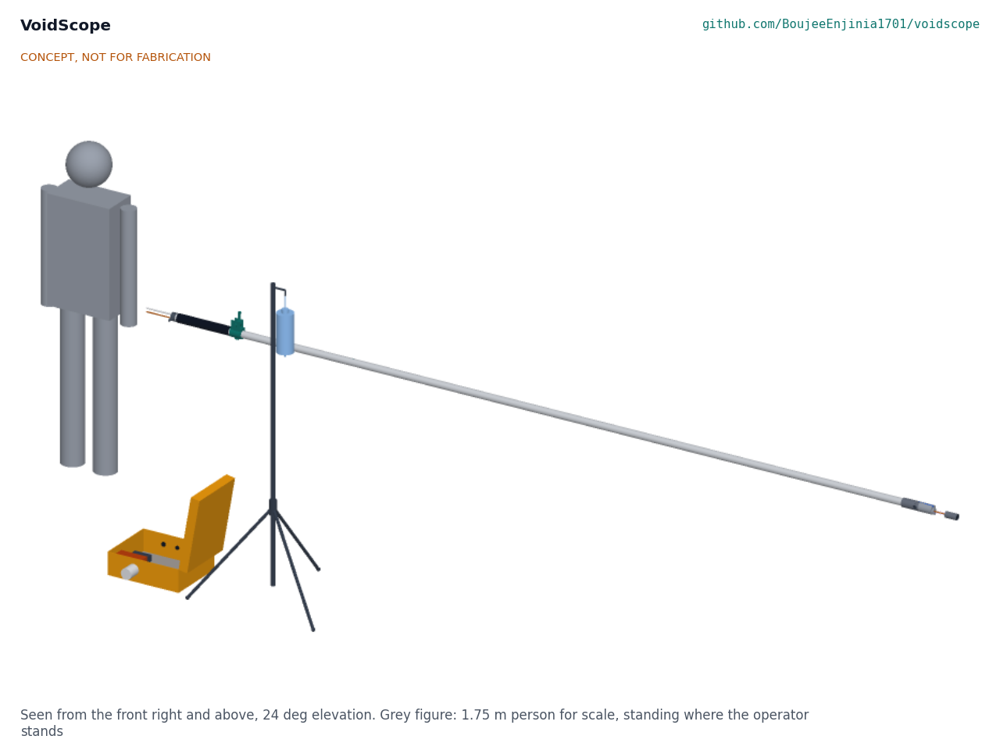
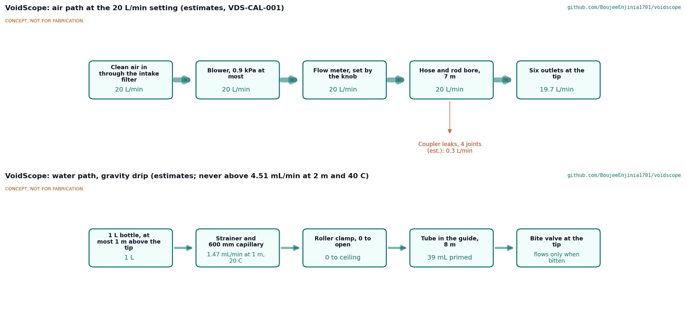

# VoidScope design precis

Searches rubble voids with a camera probe that also delivers water and air to a trapped survivor.

VoidScope is a 4.5 m push probe, 48 mm across at its widest, that passes a standard 51 mm core hole. A sealed 1080p camera with its own lights sits in a steerable tip that a thumb lever on the rod bends up to 90° to either side, so the camera looks around a bend from a straight hole; a small speaker on the head gives two-way talk. The rod is the air duct: a battery blower at the surface pushes filtered air down the bore and out of six holes at the head, at no more than 0.9 kPa even with every hole blocked. Inside the rod a guide tube carries a single-use water tube from a bottle at the surface to a bite valve on the nose, so a survivor can sip a slow gravity drip of at most 4.5 mL/min. The estimated parts cost is USD 1,780 against a value-engineering target of USD 2,000.

*Figure 1. The kit as deployed: probe held at waist height by the operator (grey figure, 1.75 m), surface unit on the ground with its lid open, water bottle on its stand.*

## How it works

Two rescuers carry two cases. The long case holds the four rod sections side by side, already threaded on the camera cable and the water guide tube like the shock cord in a tent pole, with the head at the front. The second case is the surface unit: battery, blower, flow meter, push-to-talk amplifier and a 7 in monitor with a recorder in its lid.

To search, the crew joins the sections (each snap button clicks into the next section), plugs the camera cable and the air hose into the surface unit and feeds the probe into a gap or a cored hole while watching the monitor. The camera is aimed by turning the rod; depth marks every 100 mm show how far in the tip is.

When they find someone, they leave the probe in place. They talk through the speaker at the tip, which also works as the microphone. If the team's medical lead decides that the person is conscious and able to drink, the crew hangs the water bottle on its stand no more than 1 m above the tip and opens the roller clamp. The survivor pulls the bite valve out of its pocket on the nose and sips; the tube pays out from the surface. A 600 mm capillary in the line sets the highest possible flow, so even a bottle hung too high on a hot day cannot pass more than 4.5 mL/min. The blower is set to about 20 L/min on the flow meter to freshen the air in the void while the dig goes on around the probe.

*Figure 2. Air and water paths, with estimated flows.*

## Components

*Table 1. Main components (BOM line numbers in brackets).*

| # | Component | Role |
| --- | --- | --- |
| 1 | Camera head (1) | Bought sealed pipe-inspection camera, 29 mm, IP68, AHD 1080p, 12 LEDs |
| 2 | Nose (2) and collar (3) | Turned 6061 aluminium head, 48 mm: camera bore below the axis, bite valve pocket on top, air plenum with six outlets, speaker pocket, water exit, socket for the first rod section |
| 3 | Speaker (4) | 20 mm IP67 speaker in the collar, also the microphone |
| 4 | Rod sections (5) and couplers (6) | Four 1,050 mm sections of 38.1 x 1.47 mm 6061-T6 tube; internal couplers bonded and pinned, locked by V-spring snap buttons; the bore is the air duct |
| 5 | Tail cap (7) and grip (8) | Turned cap with the air inlet barb and two grommets for the lines; rubber grip |
| 6 | Lines (9, 10, 11) | Hybrid camera and speaker cable; PTFE guide tube; single-use food-grade water tube with bite valve, capillary, roller clamp, stopcock and strainer |
| 7 | Water reservoir (12, 13) | 1 L graduated bottle hung on a light stand with height marks |
| 8 | Surface unit (14 to 23) | IP67 case with an equipment plate, LiFePO4 battery, blower, intake filter, flow meter, control modules, wall fittings, and the monitor with recorder in the lid; headset with push-to-talk |
| 9 | Support kit (24 to 28) | Air hose and sleeve, charger, rod carry case, cleaning kit and spare water sets, fixings |

## Key design choices

All choices below were decided on 2026-10-03 under Amish's pre-approval ("I pre-approve the batch runs along with any recommendations you come up with"); the TRL 2 choices are in VDS-DDR-001 and the changes made for construction in VDS-DDR-002.

1. **Lines inside the rod, with the bore as the air duct.** Nothing runs outside to catch on rebar, and the bore gives the air a large, low-loss path: about 10 Pa over the rod at 20 L/min.
2. **Rigid sectioned rod with a steerable camera tip.** The rod stays cheap and repairable and still cannot follow bends; instead the camera tip, on five pinned joints steered by two wires from a thumb lever, looks around a 45° bend from a straight hole (R11 as restated by Amish on 2026-10-03, decision 3A; VDS-DDR-003).
3. **Bought sealed camera head in a machined nose.** Sealing a camera to IP68 is the hardest part to make well; a pipe-inspection head already is.
4. **Tent-pole storage.** The sections stay threaded on the cable and guide tube, so setting up means only joining four snap buttons.
5. **Pressure-limited air.** A centrifugal blower whose shut-off pressure is at or below 1 kPa cannot pressurise a blocked void beyond that, whatever the knob says.
6. **Flow-limited water with a bite valve.** A fixed capillary sets the ceiling; the bite valve means no water leaves the tip unless the survivor bites. No pump and no pressurised water.
7. **Two-way voice at the tip.** Talking to the survivor is how the crew judges whether they are conscious and able to drink.
8. **One battery type, two packs.** 12.8 V LiFePO4 packs with built-in protection; one runs video and light for 4.3 h at -10 °C.

## First-order numbers

*Table 2. Key figures from VDS-CAL-001 (estimates, assumptions stated there).*

| Quantity | Value |
| --- | --- |
| Largest diameter; clearance in a 51 mm hole | 48 mm; 1.5 mm a side |
| Probe length; length that can go into a void | 4,538 mm; 4,131 mm |
| Camera tip: bend each way; sideways reach bent 45° | 90°; 83 mm |
| Probe mass; surface unit mass | 4.2 kg; 6.2 kg |
| Tip droop with 2 m unsupported | 17 mm |
| Buckling load of the whole rod | 940 N (4.7 times a 200 N push) |
| Pixels across a 20 mm letter at 1 m | 19 (10 needed) |
| Water ceiling: 1 m at 20 °C; 2 m at 40 °C | 1.5 mL/min; 4.5 mL/min |
| Air: total loss at 20 L/min; flow at full speed | 0.38 kPa; 44 L/min |
| Highest air pressure at a blocked tip | 0.9 kPa |
| Run time, video and light, one pack at -10 °C | 4.3 h |
| Estimated cost | USD 1,780 (USD 220 under the USD 2,000 target) |

## Patent design-arounds

From the preliminary patent, trademark and prior-art screen (not legal advice):

- Run a focused CPC patent search on combined search camera and supply probes before public release (the preliminary screen found no blocking patent).
- The rigid rod was first chosen partly to stay clear of articulation patents. The steerable tip (decision 3A) uses a plain two-wire pinned-link bending section of the kind long used in borescopes, but the focused search should now also cover articulating camera tips on search poles.
- Water is delivered by a passive, gravity-fed sanitary drip only, with no pump and no pressurised water to the survivor. The constructable design keeps this: bottle, capillary, clamp and bite valve.
- VoidScope does not adopt the proposed tethered crawler block (VDS-DDR-001, D10), so the RedZone US8024066B2 tether odometry question does not arise; the depth marks are printed on the rod.

## Shared blocks

- Rescue family siblings RubbleJack, HeapLine and SleeveDrift for procedures and kit lists.
- The tethered crawler block is not used (D10).

## Safety

> **Safety:** VoidScope is safety-critical rescue equipment. It is published as an open engineering reference, never as certified rescue equipment, and it is not a medical device.
>
> - **Structure.** Only trained rescue teams should use it, inside their own incident command and structural safety procedures. The operator never enters the void and never stands on unstable debris to push the probe.
> - **Water.** Water can be inhaled by a survivor who is drowsy, injured or lying badly. Give water only under the direction of the team's medical lead, only to a conscious person who can drink, and only by the gravity drip. Never connect a pump, a pressurised container or a syringe to the line once the probe is in the void. The capillary and bite valve are the safety stops; never remove the capillary to speed up the flow.
> - **Air.** Air must be clean and at low pressure. Filter the intake, keep it away from engine exhaust and smoke, and never connect a compressor or a gas cylinder to the tail cap. Blowing air can raise dust; start at the lowest setting and watch the picture.
> - **Battery.** The packs are 12.8 V lithium iron phosphate with built-in protection. Charge them only with the matching charger, away from the kit, on a non-combustible surface, never below 0 °C.
> - **Hygiene.** Parts that touch the survivor (water tube, bite valve) are single-use. The bottle is cleaned to a written procedure between uses.
>
> Choices that touch safety took the conservative option (VDS-DDR-001): the drip ceiling is sized for a 2 m water height at 40 °C, twice the allowed height, and the blower is chosen by its shut-off pressure rather than by a relief valve. The evidence that would relax them is listed in VDS-DEC-001.

## Next steps

- TRL 4 (not started; capped): build the prototype to VDS-BLD-001, then test it against VDS-REQ-001 with the first co-design candidate's medical lead.
