# VoidScope prototype build plan

**Plan, not yet built.** How to build the first proof-of-concept prototype, component by component. Building and testing to it is TRL 4 work. Decisions are kept in the design decisions register ([docs/06-design-decisions.md](06-design-decisions.md)), not here.

## 1. What you are building

*Figure 1. Every component pulled apart and numbered in build order. The rod sections lie side by side as they are stored; the cable, tubes, steering housings and wires are drawn cut short.*

The prototype is a 4.5 m camera probe and its surface unit. The probe is four aluminium tube sections that click together with snap buttons, a turned aluminium head holding a small speaker and a bite valve, a camera tip ahead of the head that bends up to 90° to either side, a steering lever on the rod just ahead of the grip, and a turned tail cap where the air goes in. The camera cable, a guide tube for the water and two steering wires in their housings stay threaded through the sections. The surface unit is a bought hard case holding a battery, a blower, a flow meter and small control modules, with a monitor in its lid; a water bottle hangs on a light stand beside it. Figure 1 shows the 24 components in the order you make or fit them. Fourteen are made: the rod sections, couplers, collar, nose, base link, tip housing, steering drum and tail cap (tube cutting, drilling and lathe work), the bending links and the steering control body (printed in nylon by a print service), the equipment plate and two small brackets (sheet and angle), and the drilled case. The rest are bought and fitted. The parts cost about USD 1,780 from the bill of materials.

> **Safety:** VoidScope is rescue equipment for trained teams; this prototype is not certified and it is not a medical device. The battery packs are 12.8 V lithium iron phosphate: keep the battery lead unplugged and the fuse out until section 6 says otherwise, and charge packs only on their own charger, on a non-combustible surface. Turning, drilling and cutting tube throw chips and leave sharp edges: wear safety glasses, keep hair and sleeves clear of the lathe chuck, and deburr everything. Cut steering wire ends are sharp; crimp or tape them at once. The water line must never be connected to a pump or a pressurised container, and the capillary is never removed. Two-part epoxy and threadlocker need gloves and ventilation.

## 2. What changed to make it buildable

The concept showed what the probe does; it did not say how the sections join, how the lines cross the joints or how the head fits everything inside 48 mm. Each change keeps what VoidScope does, and all of them are recorded in decision record VDS-DDR-002.

*Table 1. Changes from the concept.*

| Component | The concept had | The buildable design has | Why |
| --- | --- | --- | --- |
| Rod and joints | A rod about 50 mm across in about 1 m sections; joints not defined | 38.1 mm tube in four 1,050 mm sections, a 34.93 mm coupler bonded and pinned in each, locked by a snap button (Figure 3) | The two stock tube sizes slide together by hand, and the thinner rod leaves room for the head |
| Lines | Connectors at each joint | Cable and guide tube stay threaded through every section, like the cord in a tent pole | No connectors inside the rod; setup is four clicks |
| Air | A separate air line | The rod's own bore carries the air | Far less pressure loss; the joints need no seals |
| Water | A line inside the rod | A guide tube the single-use water tube pushes through (Figure 9) | The water set changes in about 4 minutes, no tools |
| Head | One sealed piece | A turned collar and nose joined by three screws; camera set 6.5 mm below the centre; a 20 mm speaker (Figures 5 to 8) | Each part turns on a small lathe; the bite valve and speaker fit inside 48 mm |
| Display | A handheld screen | A monitor in the lid of the surface unit (Figure 16) | One battery and one cable; the crew's hands stay on the rod |
| Surface unit | Not laid out | An equipment plate on spacers, an upright flow meter, sealed wall fittings (Figure 13) | The case stays sealed and the lid still closes |
| Details found by checking the model | A 25 mm tail cap bore, a water groove 0.5 mm too deep, a short valve pocket | A 30 mm bore with a 44 mm flange, the groove floor 20 mm from the centre, a 50 mm pocket | Each part now clears its neighbours |
| Camera tip | A rigid head; the camera behind a lip in the nose | A camera tip on five pinned joints that bends up to 90° to either side, steered by two wires from a thumb lever on the rod (Figures 18 to 24) | Amish's decision 3A: the camera must see around a 45° bend from a straight hole |
| Collar outlets | Lower outlets at 225° and 315° | Lower outlets at 240° and 300°; two stops for the steering housings in the front wall (Figure 4) | The steering housings pass where the old outlets were |
| Hinge lugs | Square lug ends | Lug ends rounded about their pins | With square ends the neighbouring link hit the lug before the full 90° bend |

## 3. Making the components

Make and check each component before the assembly step that needs it. Sizes are in millimetres. "Top" is the side the bite valve pocket is on; the tip bends to the left and right of it; the "button line" is a straight line scribed along every section and coupler, on the right side as seen from behind the tail cap, so all the buttons line up. Workshop tolerance is 0.2 mm on turned diameters and 0.5 mm elsewhere unless a step says otherwise; drawings do not carry tolerances before TRL 4.

### 3.1 Rod sections (make 4)

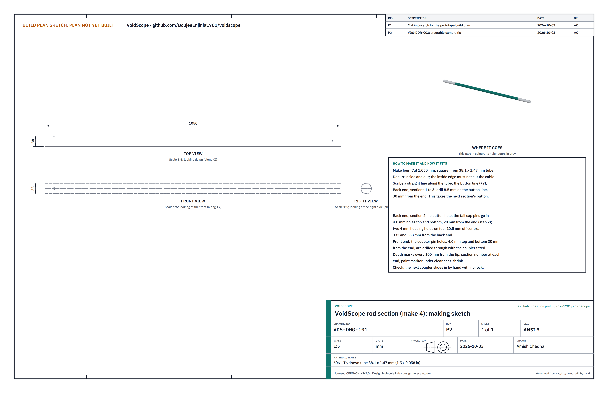

*Figure 2. Rod section making sketch (VDS-DWG-101).*

**What it is and what it is made from.** The four straight lengths of the probe. Each is 6061-T6 drawn aluminium tube, 38.1 mm (1.5 in) outside with a 1.47 mm (0.058 in) wall, 1,050 mm long.

**How to make it.**

1. Cut four lengths of 1,050 mm, square, with a fine-tooth saw or a tube cutter. Number them 1 to 4; section 1 goes next to the head.
2. Deburr both ends inside and out. The inside edge must be smooth, because the cable slides past it.
3. Scribe the button line along each tube with a straight edge.
4. Sections 1, 2 and 3: on the button line, 30 mm from the back end, drill an 8.5 mm hole (start with 3 mm, then step up). The next section's snap button comes through this hole.
5. Section 4: no button hole at the back. The tail cap pins go through it in step 2. On top of section 4, drill two 4 mm holes for the steering housings: one 332 mm from the back end and 10.5 mm to the button-line side of the top line, the other 368 mm from the back end and 10.5 mm to the other side.
6. Mark depth bands every 100 mm, counting from the tip of the assembled probe, and the section number at each end, with a paint marker. Cover each section with clear heat-shrink.

**How it fits the parts next to it.** The front end of each section takes a coupler, bonded in for 60 mm (Figure 3). The back end slides over the coupler of the section behind it until the two tube ends butt; the snap button pops through the 8.5 mm hole. Section 1's front coupler goes into the collar instead.

**Check before moving on.** A coupler slides into each back end by hand without rocking, and all four sections are 1,050 mm within 0.5 mm. On section 4 the two housing holes are deburred inside, so the housings are not cut.

### 3.2 Couplers with snap buttons (make 4)

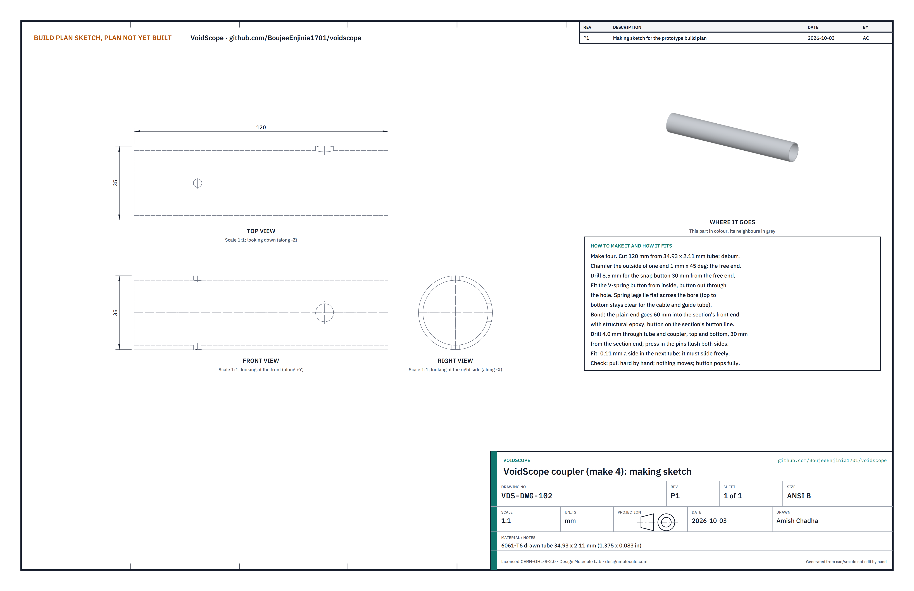

*Figure 3a. Coupler making sketch (VDS-DWG-102).*

**What it is and what it is made from.** The short inner tube that joins two sections. 6061-T6 tube, 34.93 mm (1.375 in) outside with a 2.11 mm (0.083 in) wall, 120 mm long; a stainless V-spring snap button with an 8 mm button; two 4 mm aluminium pins.

**How to make it.**

1. Cut four 120 mm lengths; deburr. Chamfer the outside of one end 1 mm at 45°: this is the free end.
2. Scribe a button line along each. On it, 30 mm from the free end, drill an 8.5 mm hole.
3. Squeeze the V-spring and slide it in from the plain end, button first, until the button snaps out through the hole. The spring strip lies across the bore from the button side to the opposite side; the spaces above and below it are where the cable and guide tube pass.
4. Bond: clean the plain end and the inside of the section's front end with solvent, coat both with structural epoxy, and push the coupler 60 mm into the section with the two button lines in line. Wipe off the squeeze-out inside.
5. Before the epoxy sets, drill 4.0 mm through tube and coupler at the top and the bottom, 30 mm from the section's front end, and press in the two pins flush both sides. Leave to cure for 24 hours.

**How it fits the parts next to it.**

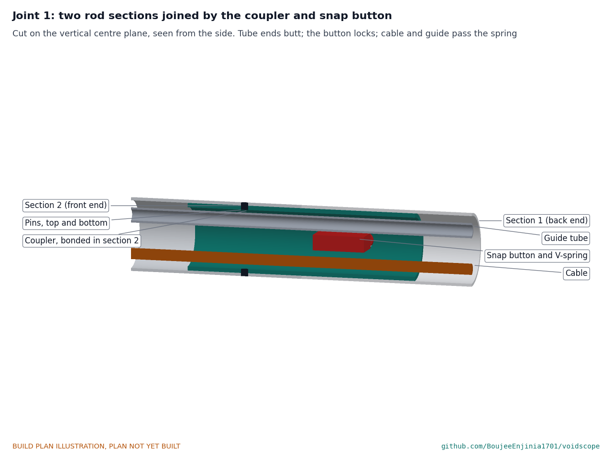

*Figure 3. The coupler is bonded and pinned into one section and slides into the next; the tube ends butt and the button locks. The cable and guide tube pass above and below the spring.*

The coupler's outside slides inside the next tube with about 0.11 mm a side. Push loads go through the butted tube ends; pull and twist go through the button. The spring sits 3.0 mm from the cable and 2.0 mm from the guide tube.

**Check before moving on.** Each joint clicks together and comes apart with one press of the button; a hard pull by hand moves nothing.

### 3.3 Collar

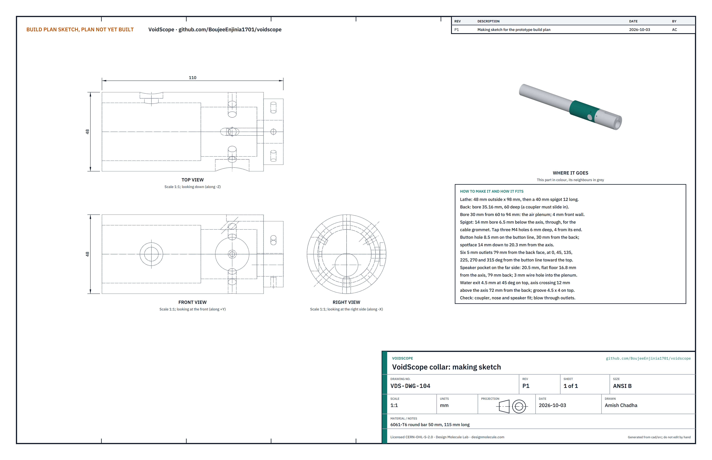

*Figure 4. Collar making sketch (VDS-DWG-104).*

**What it is and what it is made from.** The back half of the head: it takes the first rod section, turns the air out through six holes, holds the speaker, lets the water tube out and carries the nose. 6061-T6 round bar, 50 mm, 115 mm long.

**How to make it.**

1. On the lathe, turn to 48 mm outside for 98 mm and a 40 mm spigot 12 mm long at the front; part off.
2. From the back face, bore 35.16 mm, 60 mm deep, so a coupler slides in. Then bore 30 mm on to 94 mm from the back face: the air chamber. Leave a 4 mm front wall.
3. Through the spigot, bore 14 mm on a centre 6.5 mm below the axis (offset in a four-jaw chuck, or drill and ream on a drill press with the collar in a vee block). This takes the cable grommet.
4. Tap three M4 holes 6 mm deep into the spigot, 4 mm from its front end, at the positions on the sketch.
5. On the button line, 30 mm from the back face, drill 8.5 mm, then spotface 14 mm across until the floor is 20.3 mm from the axis, so a fingertip reaches the button.
6. Drill six 5 mm air holes into the chamber, 79 mm from the back face: on the button line, at 45° and 135° above it, and at 240°, 270° and 300° (bottom and the lower side).
7. On the side opposite the button line, at 79 mm from the back face, mill a 20.5 mm flat-bottomed pocket down to 16.8 mm from the axis for the speaker; drill a 3 mm wire hole from its floor into the chamber.
8. On top, drill the 4.5 mm water exit at 45° through into the chamber, its axis crossing 12 mm above the axis at 72 mm from the back face (use a 45° vee block on the drill press). Mill a groove 4.5 mm wide on top from the exit to the front face, its floor 20 mm above the axis.
9. For the steering, from inside the chamber, counterbore two 3.2 mm holes 2 mm deep into the front wall, each 10.5 mm to one side of the centre and 7.5 mm below it; the housings end in these. Through the middle of each, drill 1.2 mm on through the wall and the spigot for the wire.
10. Deburr every hole inside and out; the water tube, the wires and the air must meet no sharp edge.

**How it fits the parts next to it.**

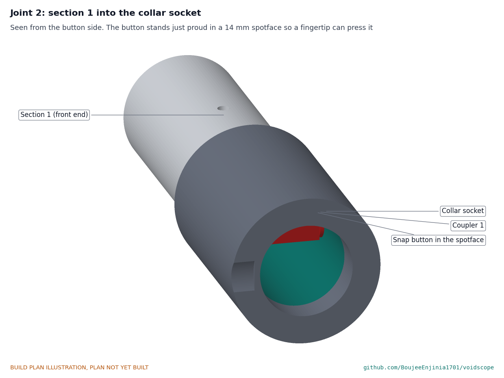

*Figure 5. Section 1's coupler slides into the collar socket until the tube butts the collar; the button stands just proud in its spotface.*

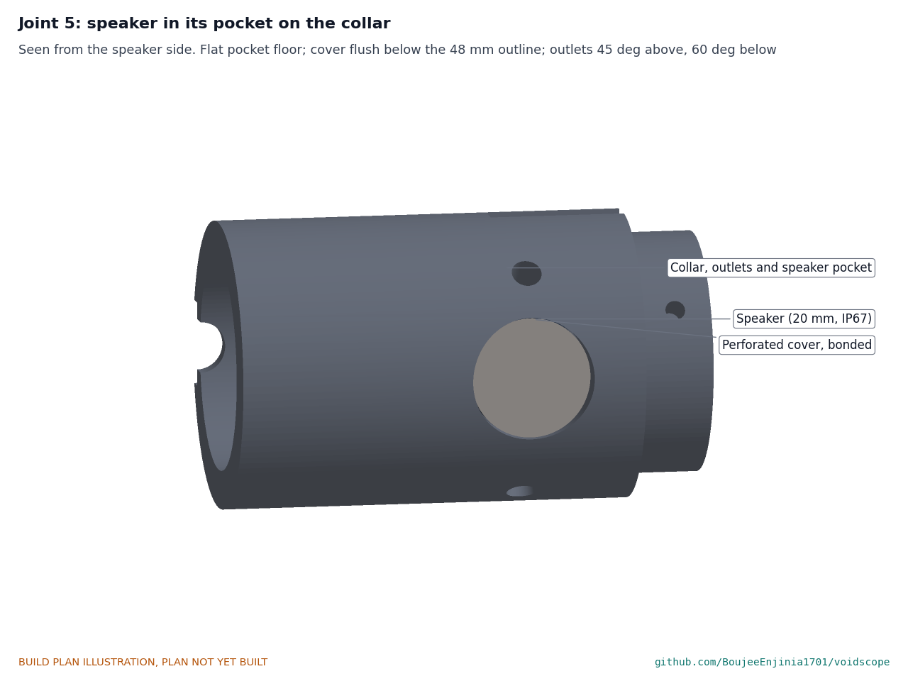

*Figure 6. The 20 mm speaker sits on the flat floor of its pocket under a bonded perforated cover, flush inside the 48 mm outline; air holes lie 45° above it and 60° below it.*

The socket takes section 1 exactly like a rod joint. The 40 mm spigot fits the nose's 40.2 mm counterbore. The speaker is bedded in neutral-cure silicone and its cover bonded on top.

**Check before moving on.** A coupler slides into the socket and the button pops into the spotface. Air blown into the socket comes out of all six holes.

### 3.4 Nose

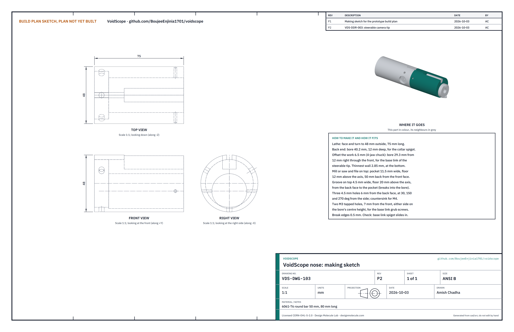

*Figure 7. Nose making sketch (VDS-DWG-103).*

**What it is and what it is made from.** The front of the head: it carries the steerable camera tip in its bore and parks the bite valve on top. 6061-T6 round bar, 50 mm, 80 mm long.

**How to make it.**

1. Turn to 48 mm outside and 75 mm long. From the back face, bore 40.2 mm, 12 mm deep, to fit the collar spigot.
2. Set the work 6.5 mm off centre in a four-jaw chuck, the offset away from the top. Bore 29.3 mm from 12 mm from the back face right through the front. The thinnest wall is 2.85 mm, at the bottom.
3. On top, cut the bite valve pocket: 11.5 mm wide, its floor 12 mm above the axis, 50 mm long, open at the front. A mill is best; a saw and file will do.
4. Continue a groove 4.5 mm wide on top, floor 20 mm above the axis, from the back face to the pocket. Over the counterbore it breaks through; that is intended.
5. Drill three 4.5 mm holes 6 mm from the back face at the same angles as the tapped holes in the spigot, and countersink them for M4 screws.
6. On the two sides, 7 mm back from the front face and level with the bore's centre, drill and tap M3 into the bore for the base link's grub screws.
7. Break every edge by 0.5 mm, especially at the front and the pocket.

**How it fits the parts next to it.**

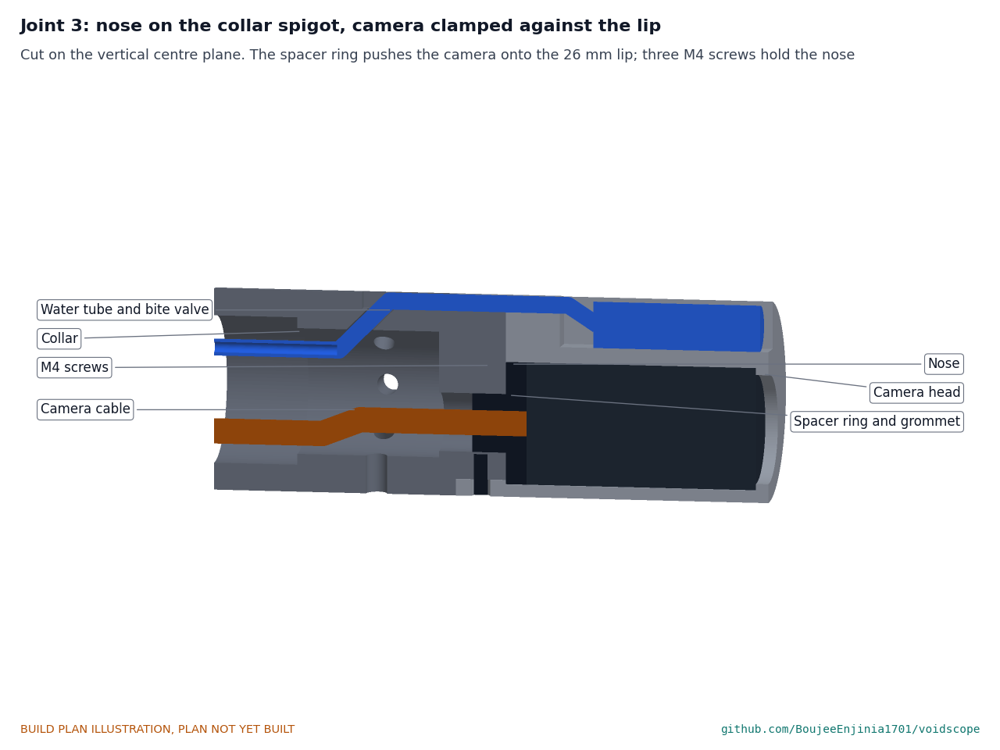

*Figure 8. Three M4 screws hold the nose on the spigot. The base link of the camera tip slides into the front of the nose bore and two M3 grub screws hold it. A steering wire leaves its housing in the collar wall and runs along the nose bore into the base link.*

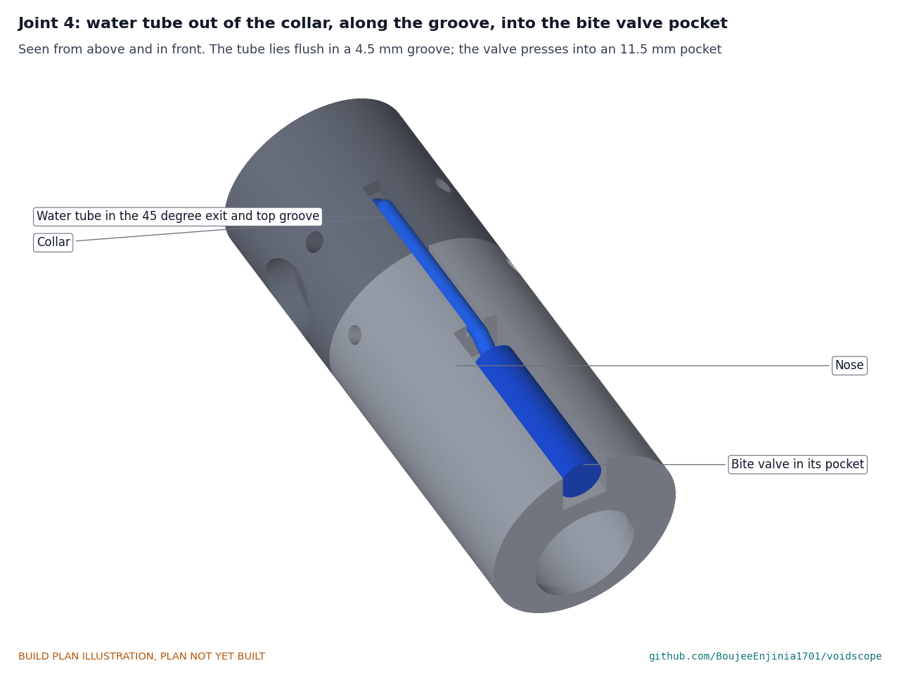

*Figure 9. The water tube leaves the collar through the 45° exit, lies flush in the top groove and ends in the bite valve, pressed into its pocket on the nose.*

**Check before moving on.** The base link's spigot slides into the front of the bore by hand without rocking. The nose slides onto the spigot and the three screw holes line up. A bite valve presses into the pocket and stays there when the nose is shaken.

### 3.5 Tail cap

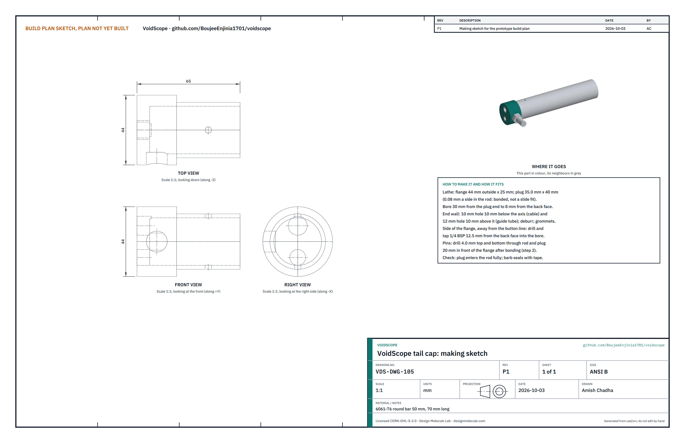

*Figure 10. Tail cap making sketch (VDS-DWG-105).*

**What it is and what it is made from.** The plug in the back end of section 4: the air goes in here, and the cable and guide tube come out through two grommets. 6061-T6 round bar, 50 mm, 70 mm long; a brass 1/4 BSP to 12 mm hose barb; two split rubber grommets; two 4 mm pins.

**How to make it.**

1. Turn a 44 mm flange 25 mm long and a 35.0 mm plug 40 mm long. The plug is 0.08 mm a side smaller than the tube's bore: a bonded fit, not a slide fit.
2. Bore 30 mm from the plug end to 8 mm from the back face, leaving an 8 mm end wall.
3. In the end wall, drill a 10 mm hole 10 mm below the axis for the cable grommet and a 12 mm hole 10 mm above it for the guide tube grommet. Deburr. Split each grommet on one side so the lines can be laid in.
4. In the side of the flange opposite the button line, 12.5 mm from the back face, drill and tap 1/4 BSP into the bore. Fit the barb with thread-seal tape.

**How it fits the parts next to it.**

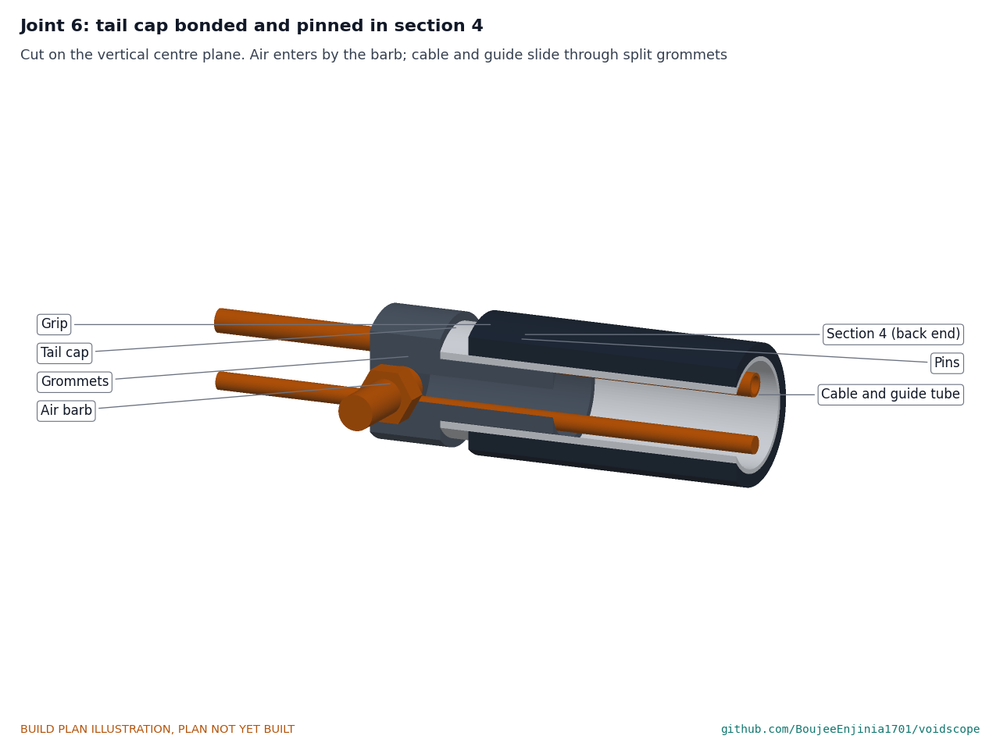

*Figure 11. The plug is bonded into section 4 against the flange and pinned top and bottom; air comes in by the barb; the cable and guide tube slide through the grommets.*

**Check before moving on.** The plug goes fully into section 4 dry. Blowing into the barb with a thumb over each grommet, air comes out of the plug end only.

### 3.6 Equipment plate

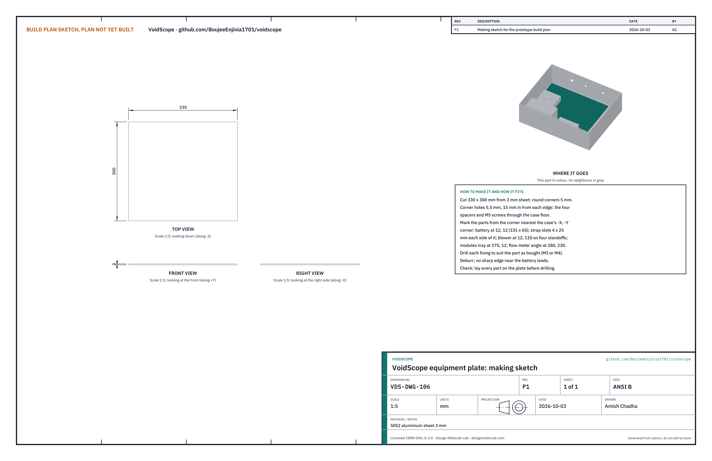

*Figure 12. Equipment plate making sketch (VDS-DWG-106).*

**What it is and what it is made from.** The flat plate in the bottom of the case that every surface unit part is fixed to. 5052 aluminium sheet, 3 mm, 330 x 300 mm.

**How to make it.**

1. Cut the blank; round the corners to 5 mm; deburr.
2. Drill four 5.5 mm holes, 15 mm in from each edge at the corners.
3. Lay out the parts from the corner that will sit nearest the case's back left corner: the battery 12 mm in from both edges, with two pairs of 4 x 25 mm strap slots beside it; the blower 12 mm from the left edge and 110 mm from the front, on four standoffs; the control modules tray 175 mm from the left edge; the flow meter bracket 280 mm from the left edge and 230 mm from the front.
4. Drill each fixing hole to suit the part as bought (M3 or M4).

**How it fits the parts next to it.**

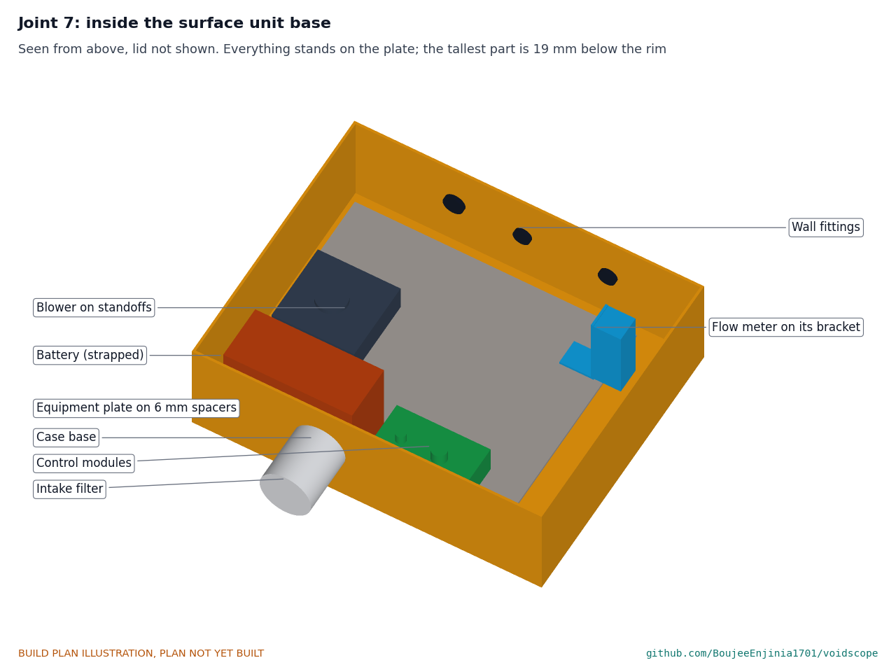

*Figure 13. The plate stands on four 6 mm spacers, screwed through the floor; everything else stands on the plate. The tallest part is 19 mm below the rim.*

**Check before moving on.** Every part sits on the plate without overlapping another, and the plate drops into the case with 6 mm clear of every wall.

### 3.7 Flow meter bracket

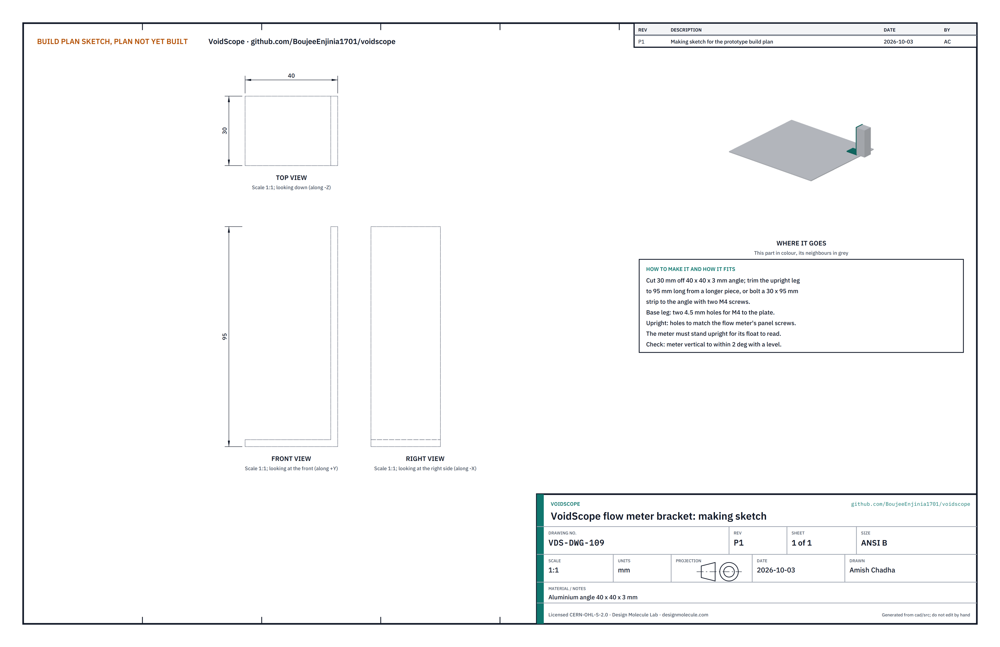

*Figure 14. Flow meter bracket making sketch (VDS-DWG-109).*

**What it is and what it is made from.** A short aluminium angle that holds the flow meter upright. Aluminium angle 40 x 40 x 3 mm.

**How to make it.** Cut 30 mm of angle and extend the upright leg to 95 mm with a bolted strip if the angle is too short. Drill two 4.5 mm holes in the base leg and holes in the upright to match the flow meter's panel screws.

**How it fits the parts next to it.** The base leg bolts to the plate with two M4 screws; the meter screws to the upright. The meter must stand upright for its float to read.

**Check before moving on.** With the plate on a level bench, the meter is vertical within 2° on a spirit level.

### 3.8 Monitor bracket

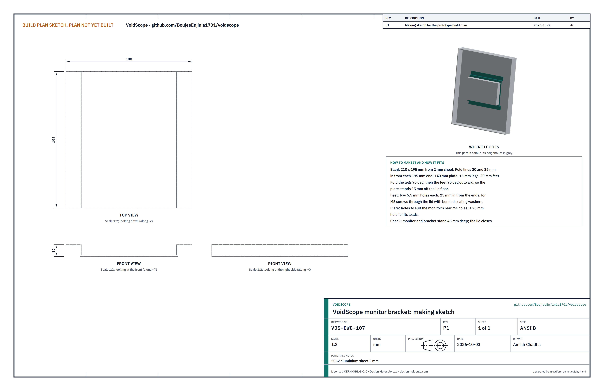

*Figure 15. Monitor bracket making sketch (VDS-DWG-107), drawn as it sits with the lid closed.*

**What it is and what it is made from.** A folded plate that holds the monitor 15 mm off the lid floor. 5052 aluminium sheet, 2 mm.

**How to make it.**

1. Cut a 210 x 195 mm blank. Mark fold lines 20 mm and 35 mm in from each 195 mm end.
2. Fold the 35 mm lines 90° up (the legs) and the 20 mm lines 90° out (the feet).
3. Drill two 5.5 mm holes in each foot, 25 mm in from its ends; drill the plate to match the monitor's rear M4 holes and a 25 mm hole for its leads.

**How it fits the parts next to it.**

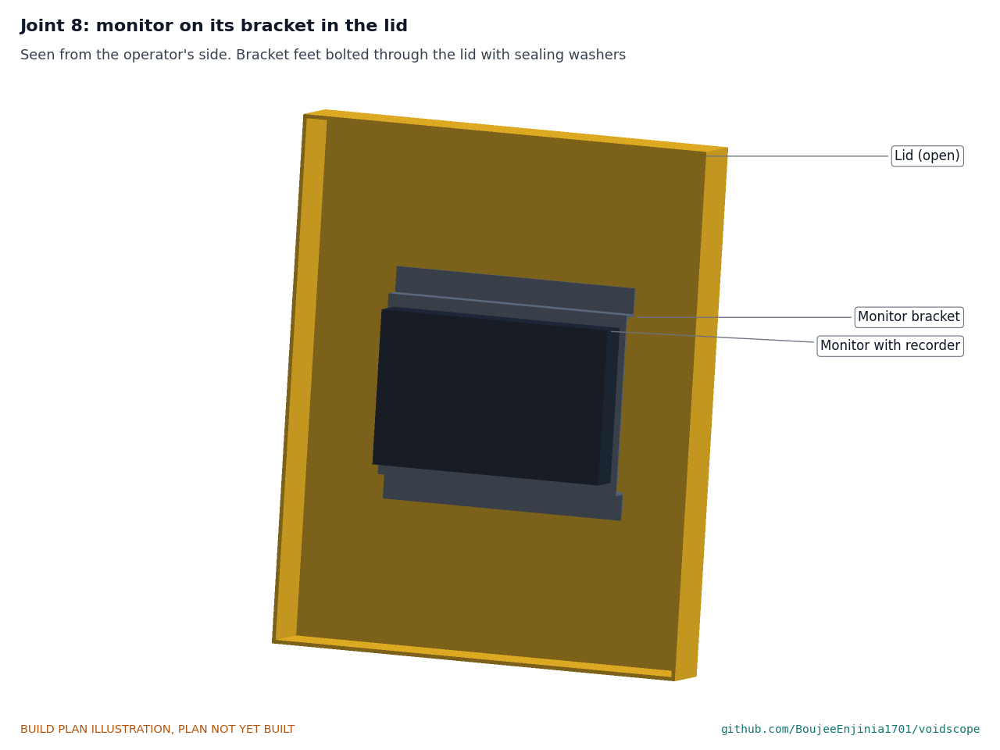

*Figure 16. The bracket's feet bolt through the lid; the monitor screws to the bracket's plate and faces the operator when the lid is open.*

**Check before moving on.** Bracket and monitor together stand 45 mm deep or less, so the lid still closes.

### 3.9 Surface unit case, drilled

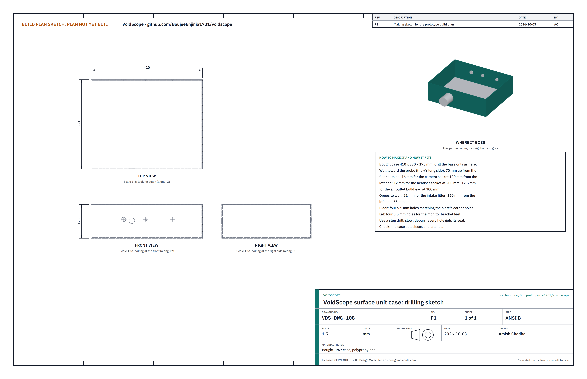

*Figure 17. Case drilling sketch (VDS-DWG-108).*

**What it is and what it is made from.** A bought IP67 hard case, about 410 x 330 x 175 mm outside, drilled for the plate, the wall fittings and the filter, and its lid drilled for the monitor bracket.

**How to make it.**

1. On the long wall that will face the probe, 70 mm up from the floor outside: drill 16 mm for the camera socket 120 mm from the left end, 12 mm for the headset socket at 200 mm and 12.5 mm for the air outlet at 300 mm.
2. On the opposite wall, drill 21 mm for the intake filter, 150 mm from the left end and 65 mm up.
3. In the floor, drill four 5.5 mm holes to match the plate's corner holes (use the plate as a template). In the lid, drill four 5.5 mm holes to match the bracket feet.
4. Use a step drill at low speed so the plastic does not crack; deburr every hole.

**How it fits the parts next to it.** Every fitting goes through its hole with its seal on the outside and its nut inside; every screw through the floor or lid has a bonded sealing washer, so the case stays sealed.

**Check before moving on.** The case closes and latches with nothing fitted.

### 3.10 Bending links (make 4)

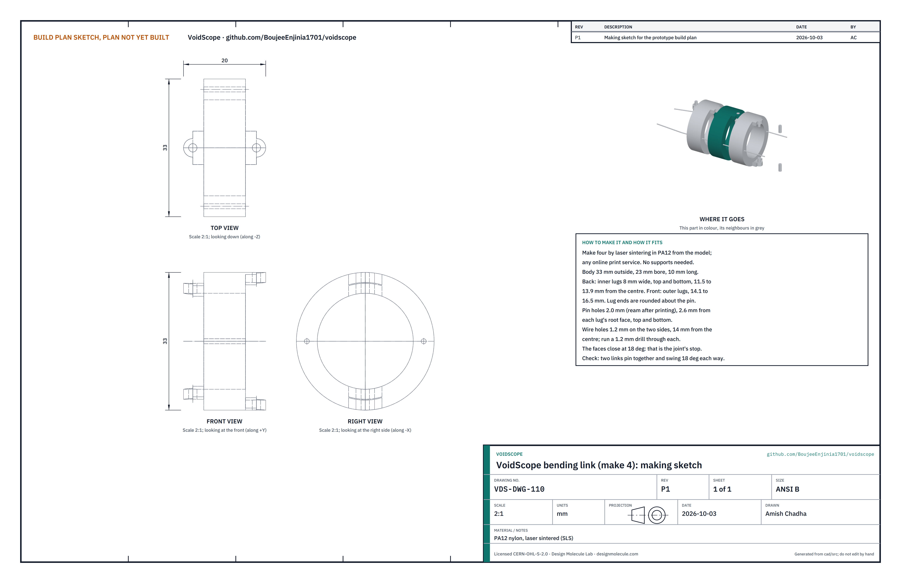

*Figure 18. Bending link making sketch (VDS-DWG-110).*

**What it is and what it is made from.** The four short rings that let the camera tip bend. Each is printed in PA12 nylon by laser sintering (any online print service can make them from the model): a ring 33 mm across with a 23 mm bore and a 10 mm body, with a pair of thin lugs top and bottom at each end.

**How to make it.**

1. Order four links printed in PA12 from the model file. No supports are needed.
2. Ream the four 2.0 mm pin holes in each link. The holes sit 2.6 mm from the face each lug grows out of.
3. Run a 1.2 mm drill through the two wire holes on the sides, 14 mm out from the centre.
4. Clean off loose powder; the lug ends are rounded and must stay that way.

**How it fits the parts next to it.**

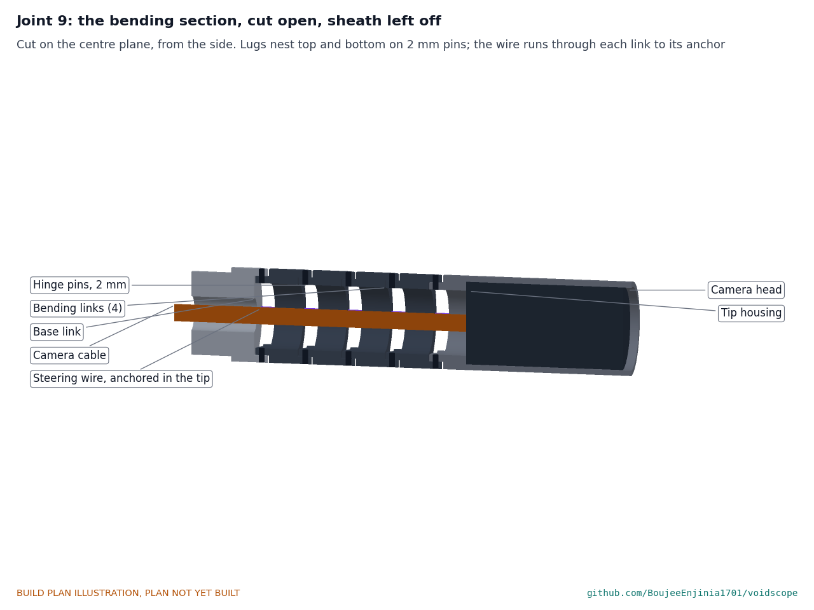

*Figure 19. The links nest lug inside lug, top and bottom, on 2 mm pins. Each joint closes at 18°, so the five joints give 90° each way. The steering wire runs through every link to its anchor in the tip housing; the camera cable runs down the middle.*

The back lugs of each link sit inside the front lugs of the one behind, 0.2 mm apart, with a 2 mm stainless pin through each pair. The pin is a press fit in the outer lug and turns freely in the inner one. A 0.6 mm silicone sheath goes over the whole bending section; its ends are bound with waxed thread and sealed with silicone.

**Check before moving on.** Two links pinned together swing 18° each way, then their faces meet. They do not wobble, and a 0.6 mm wire slides through both wire holes.

### 3.11 Base link

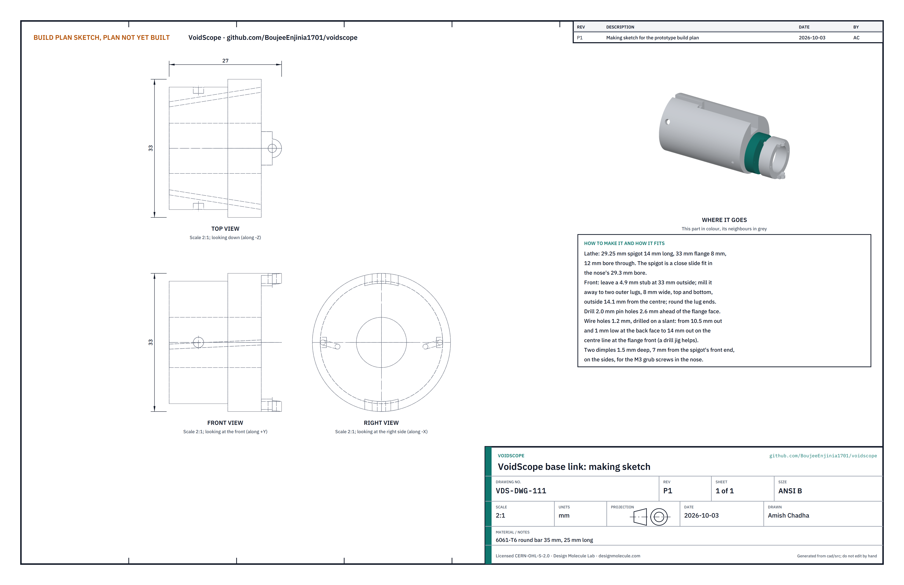

*Figure 20. Base link making sketch (VDS-DWG-111).*

**What it is and what it is made from.** The fixed first joint of the tip: it plugs into the nose and carries the first pair of lugs. 6061-T6 round bar, 35 mm, 25 mm long; two M3 nylon-tipped grub screws.

**How to make it.**

1. Turn a 29.25 mm spigot 14 mm long and a 33 mm flange 8 mm long, and bore 12 mm through. The spigot is a close slide fit in the nose's 29.3 mm bore.
2. Leave a 4.9 mm stub ahead of the flange, 33 mm across; mill it away except for two lugs 8 mm wide at the top and bottom, from 14.1 mm out to the outside. Round the lug ends; drill 2.0 mm pin holes 2.6 mm ahead of the flange face.
3. Drill the two 1.2 mm wire holes on a slant: each starts at the back face 10.5 mm to one side and 1 mm below the centre, and comes out of the flange front 14 mm to that side on the centre line. A small drill jig makes this easier.
4. Drill two dimples 1.5 mm deep in the spigot's sides, 7 mm from its front end, for the grub screw points.

**How it fits the parts next to it.** The spigot goes into the front of the nose until the flange meets the nose's front face, wire holes to the sides and lugs top and bottom. The two grub screws go in through the nose's sides into the dimples. Link 1's back lugs fit inside the base link's lugs.

**Check before moving on.** The spigot slides into the nose by hand, the flange sits flat on the nose's front face and the screws hold it without play.

### 3.12 Tip housing

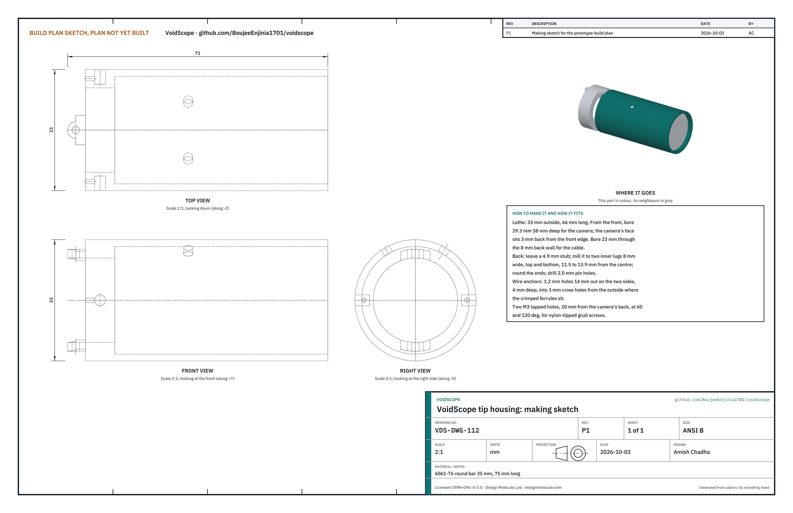

*Figure 21. Tip housing making sketch (VDS-DWG-112).*

**What it is and what it is made from.** The last joint of the tip, holding the camera. 6061-T6 round bar, 35 mm, 75 mm long; two M3 nylon-tipped grub screws; two 2.5 mm crimp ferrules.

**How to make it.**

1. Turn to 33 mm outside and 66 mm long. From the front, bore 29.3 mm, 58 mm deep, for the camera. Bore 23 mm through the 8 mm back wall for the cable.
2. Leave a 4.9 mm stub at the back; mill it to two lugs 8 mm wide at the top and bottom, from 11.5 to 13.9 mm out; round the ends; drill 2.0 mm pin holes.
3. Wire anchors: on each side, 14 mm out from the centre, drill 1.2 mm in from the back face 4 mm deep, into a 3 mm cross hole drilled in from the outside. The crimped ferrule sits in the cross hole.
4. Drill and tap two M3 holes 20 mm from the camera's back face, at 60° and 120° from the side toward the top, for the camera's grub screws.

**How it fits the parts next to it.** The camera slides in from the front until its back meets the step; its face then sits 3 mm behind the front edge, protected. Two nylon-tipped grub screws hold it without marking it. The housing's back lugs fit inside link 4's front lugs.

**Check before moving on.** The camera slides in by hand and its face sits 3 mm back. A wire with a crimped ferrule pulls tight against its anchor without slipping.

### 3.13 Steering control

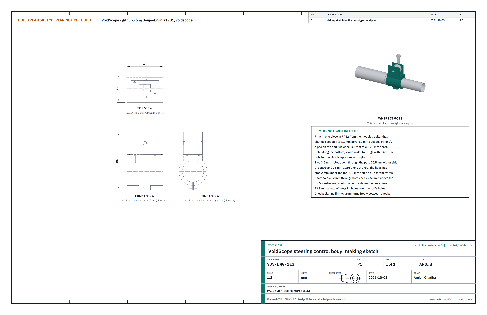

*Figure 22. Steering control body making sketch (VDS-DWG-113).*

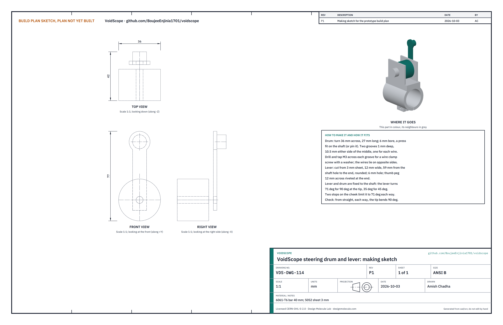

*Figure 23. Steering drum and lever making sketch (VDS-DWG-114).*

**What it is and what it is made from.** The handle end of the steering, clamped on section 4 just ahead of the grip. The body is printed in PA12 nylon in one piece: a collar that clamps the rod, a pad on top and two cheeks 28 mm apart. Between the cheeks a 36 mm aluminium drum on a 6 mm stainless shaft winds the two wires; a 50 mm lever with a thumb peg turns it, and a knob on the other side locks it by friction. Bought: the shaft, the knob with a spring washer, an M4 clamp screw and nut.

**How to make it.**

1. Order the body printed in PA12 from the model file. Clean out the two 3.2 mm housing holes and the 1.2 mm wire holes above them, and the 6.2 mm shaft holes in the cheeks.
2. Turn the drum from 40 mm bar: 36 mm across, 27 mm long, a 6 mm bore. Cut two grooves 1 mm deep, 10.5 mm either side of the middle. Drill and tap M3 across each groove for a small clamp screw and washer.
3. Cut the lever from 3 mm sheet, 12 mm wide and 59 mm from the shaft hole to its rounded end; rivet a 12 mm thumb peg at the end.
4. Fit two small stops on the lever's cheek so it turns 71° each way from upright, and mark the upright position: the tip is straight there.

**How it fits the parts next to it.**

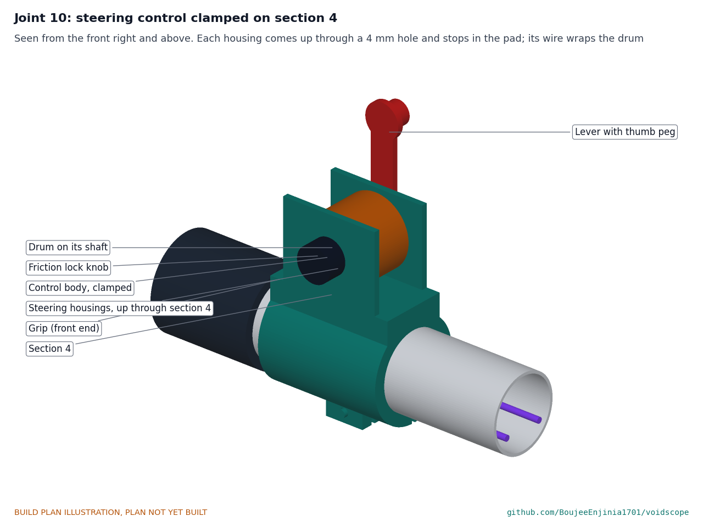

*Figure 24. The body clamps section 4 8 mm ahead of the grip. Each housing comes up through its 4 mm hole and stops in the pad; its wire goes on up to its groove on the drum.*

The body's two housing holes sit over section 4's two 4 mm holes. The lever turns the drum: from upright, 35° of lever bends the tip 45°, and 71° bends it 90°. About 5 N at the thumb holds the full bend. The knob squeezes the cheeks to hold any position.

**Check before moving on.** The body clamps firmly with the screw done up, and the drum turns freely between the cheeks with 0.5 mm to spare on each side.

### 3.14 Bought components

- **Camera head:** sealed pipe-inspection head, 29 mm across, about 55 mm long, IP68, 1080p (AHD), about 90° view, 12 dimmable LEDs, 12 V, with a pigtail at least 170 mm long. Trim the pigtail to 170 mm: it runs back through the tip to a splice in the nose bore.
- **Speaker:** 20 mm IP67 micro speaker, 8 Ω, 0.5 W, about 4 mm thick; a 20 mm disc of perforated stainless sheet as its cover.
- **Cable:** hybrid camera cable, 7 m, with one mini-coax for video and four small cores, 6 mm across at most, with a six-pin aviation plug fitted at the surface end.
- **Guide tube:** PTFE, 8 mm outside, 6 mm bore, 6.5 m.
- **Water set (single use):** food-grade polyurethane tube 4 mm by 2.5 mm, 8 m; silicone bite valve about 11 mm across; 600 mm of 0.5 mm bore food-grade PTFE capillary with two barbed reducers; roller clamp; three-way stopcock; 100 micron strainer; 60 mL syringe. Keep it sealed in its bag until use.
- **Grip:** rubber or foam handlebar grip tube, 38 mm bore, 300 mm.
- **Battery packs (2):** 12.8 V 6 Ah LiFePO4 with built-in protection and an XT60 lead, about 151 x 65 x 94 mm, with a hook-and-loop strap.
- **Blower:** 12 V centrifugal, about 97 x 94 x 33 mm, shut-off pressure 1.0 kPa or less, PWM speed input.
- **Intake filter, flow meter, control modules, wall fittings, headset:** as in the bill of materials, lines 19 to 23.
- **Monitor:** 7 in, AHD input, recorder, 1000 nit or brighter, 12 V, rear M4 holes, 28 mm deep or less.
- **Reservoir:** 1 L graduated food-grade bottle with a bail and a bottom spigot; light stand 0.8 to 2.0 m with a hook arm; mark the stand every 0.1 m.
- **Air hose and sleeve, charger, rod carry case, cleaning kit:** as in the bill of materials, lines 24 to 27.
- **Hinge pins and sheath:** ten 2 x 5 mm stainless dowel pins; silicone tube 33 mm bore, 0.6 mm wall, 80 mm long, two (one spare).
- **Steering wires and housings:** 0.6 mm 7x7 stainless wire rope, two 6 m lengths; PTFE-lined steel-coil push-pull housing 3 mm outside, two 4.4 m lengths; four 2.5 mm crimp ferrules.
- **Steering control fittings:** 6 mm stainless shaft 50 mm long; a friction lock knob with a spring washer; M4 clamp screw and nyloc nut; four M3 nylon-tipped grub screws for the base link and the camera.

## 4. Putting it together

In each picture the parts already fitted are grey and the part being fitted is in colour, with an arrow showing the way it goes in. Long parts are drawn cut short where the whole length would make the picture unreadable.

### Step 1: couplers into the sections

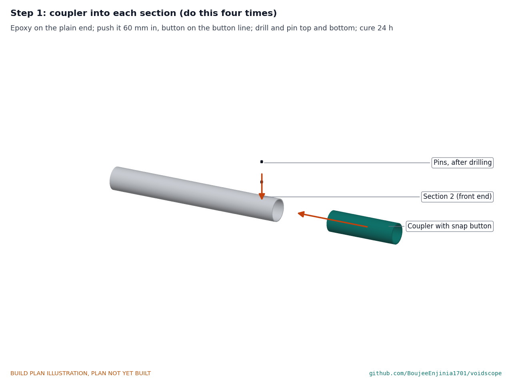

Done for each of the four sections in section 3.2: epoxy, push in 60 mm with the button lines in line, drill and pin top and bottom, cure for 24 hours. Hold point: do not join any section until the epoxy has cured.

### Step 2: tail cap into section 4

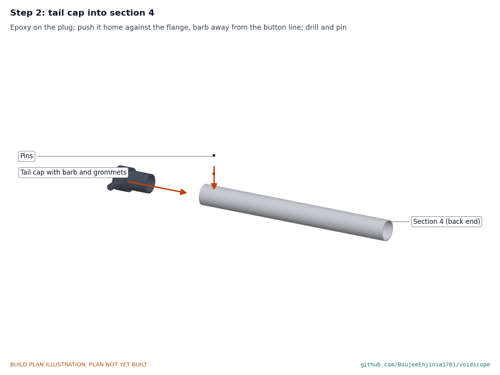

Epoxy on the plug and in the back end of section 4; push home against the flange with the barb opposite the button line; drill 4.0 mm through tube and plug top and bottom, 20 mm in front of the flange, and press in the pins.

### Step 3: grip and steering control body onto section 4

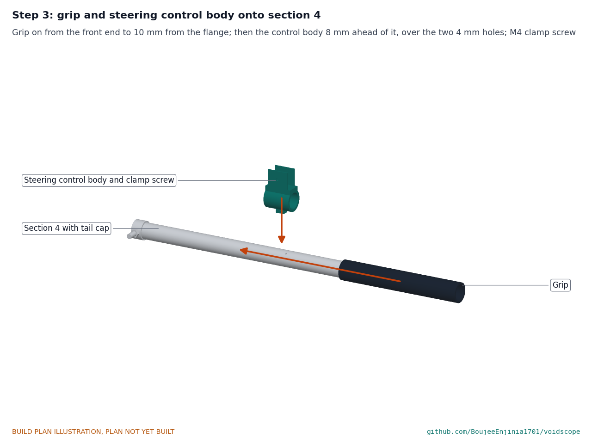

Wet the inside of the grip with soapy water and slide it on from the front end of section 4 until it stops 10 mm in front of the flange. Let it dry. Then slide the steering control body on from the front end until it is 8 mm ahead of the grip, with its two housing holes over the two 4 mm holes on top of section 4. Do up the M4 clamp screw.

### Step 4: speaker into the collar

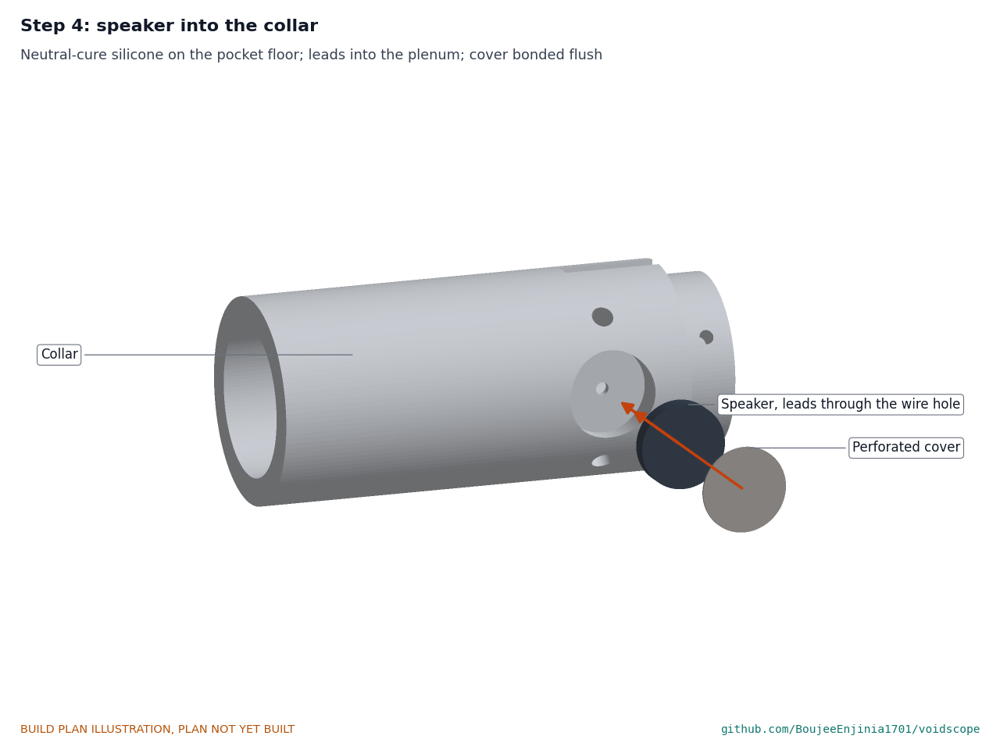

Feed the speaker leads through the 3 mm wire hole into the chamber. Bed the speaker on neutral-cure silicone, then bond the perforated cover over it, flush.

### Step 5: thread the cable, guide tube and steering housings through every section

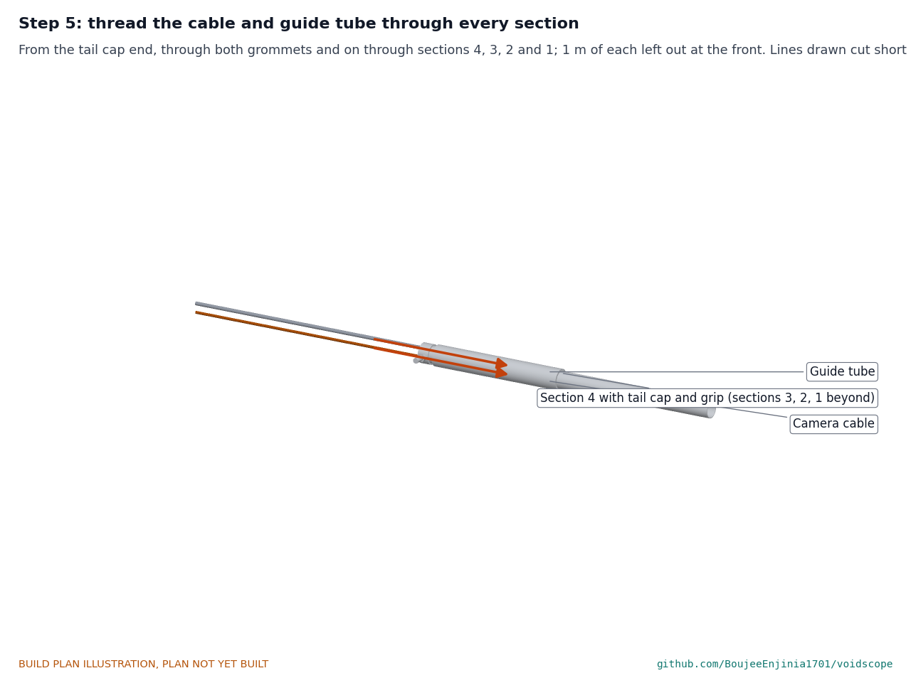

Lay the sections in a line, tail cap at the back. From the tail cap end, feed the cable and the guide tube through their grommets and through sections 4, 3, 2 and 1 in turn, staying in the spaces above and below each spring. Feed each steering housing, with its wire inside it, down through its hole in the control body and section 4, then forward through sections 4 to 1 low down on its own side, below the springs. Leave 1 m of the cable and guide out at the front and about 2 m of each behind the tail cap. Seal round the housings where they pass section 4 with a little silicone.

### Step 6: cable, guide tube and housings into the collar

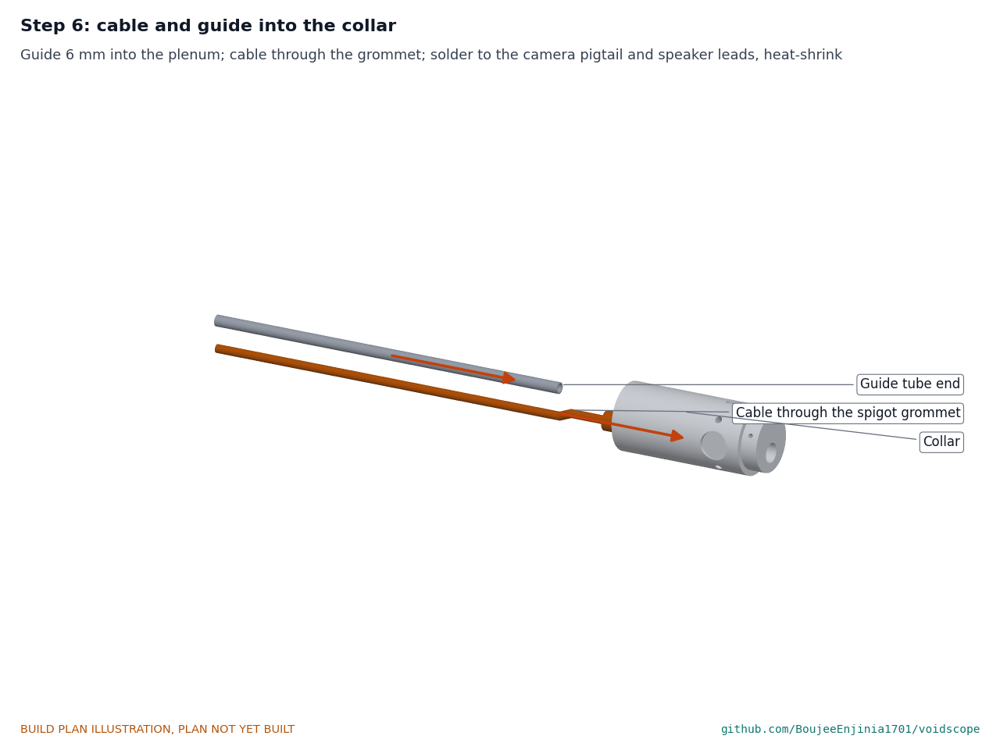

Push the guide tube 6 mm into the collar's air chamber. Push each housing into its 3.2 mm stop in the chamber's front wall and its wire on through the 1.2 mm hole and out of the spigot. Break the speaker pair out of the cable inside the chamber and solder it to the speaker leads; pass the rest of the cable through the spigot grommet. Cover every joint with heat-shrink and seal the grommet with a little silicone.

### Step 7: nose onto the collar

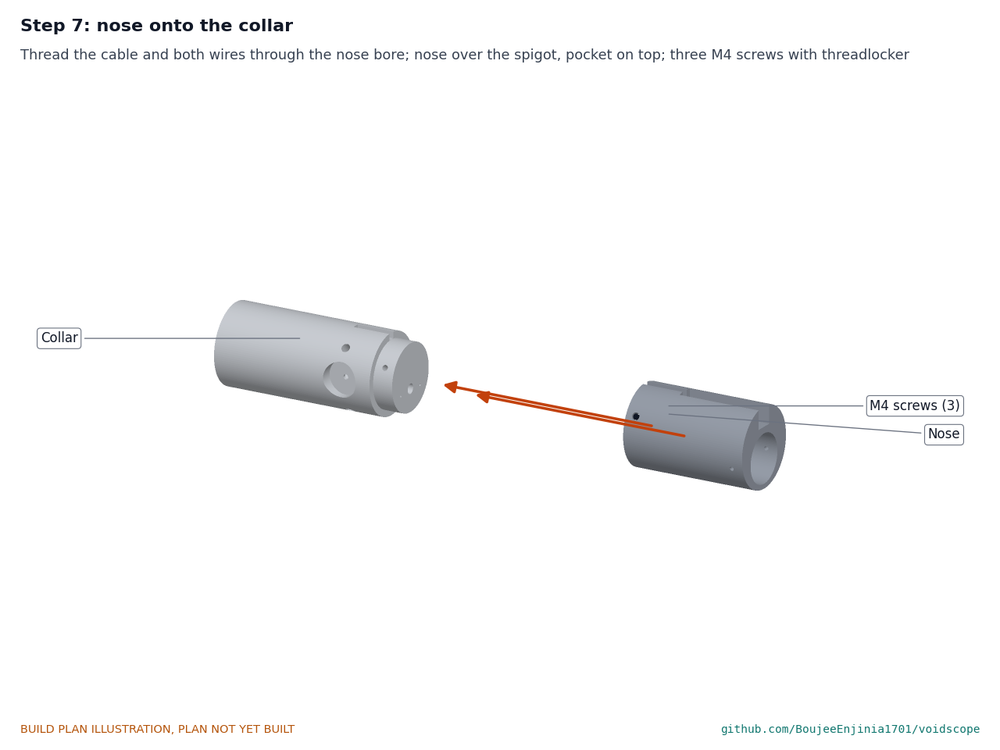

Thread the cable and both wires through the nose's bore from behind. Slide the nose onto the spigot with its pocket on top and fix it with three M4 countersunk screws and threadlocker.

### Step 8: steerable tip onto the nose

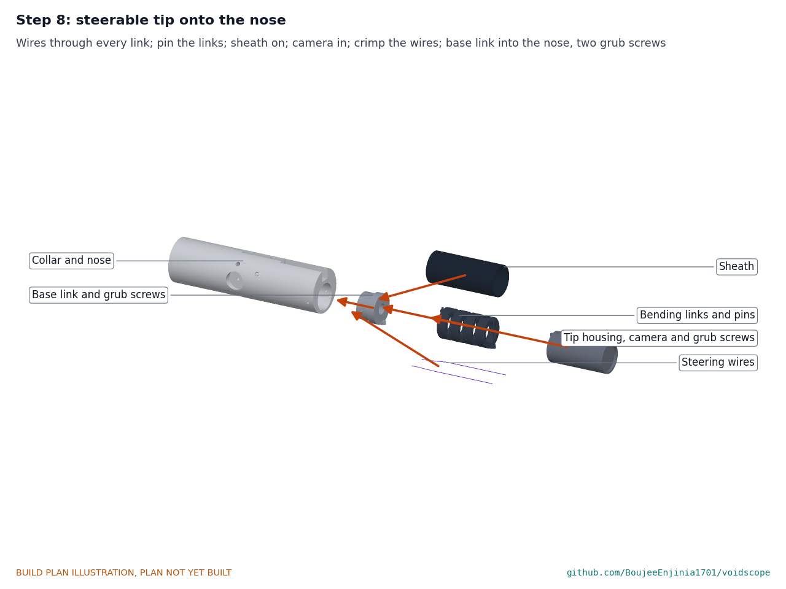

Thread each wire through its slanted hole in the base link, then through the side holes of links 1 to 4 in turn, and the camera pigtail back through the tip housing, the links and the base link. Pin the joints: each pin is pressed into the outer lug and turns in the inner one. Slide the sheath over the bending section and bind its ends. Splice the camera pigtail to the cable in the nose bore and heat-shrink it, then push the base link into the nose and fit its two grub screws. Push the camera into the tip housing until it meets the step and fit its two grub screws. Pull each wire through its anchor hole, crimp a ferrule on it in the cross hole, and trim it.

### Step 9: section 1 into the collar

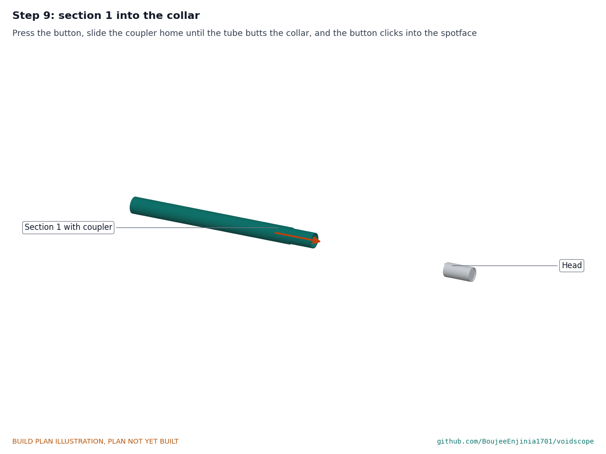

Slide section 1 forward along the lines, press its front button and push the coupler into the collar socket until the tube butts the collar and the button clicks into the spotface.

### Step 10: join sections 2, 3 and 4

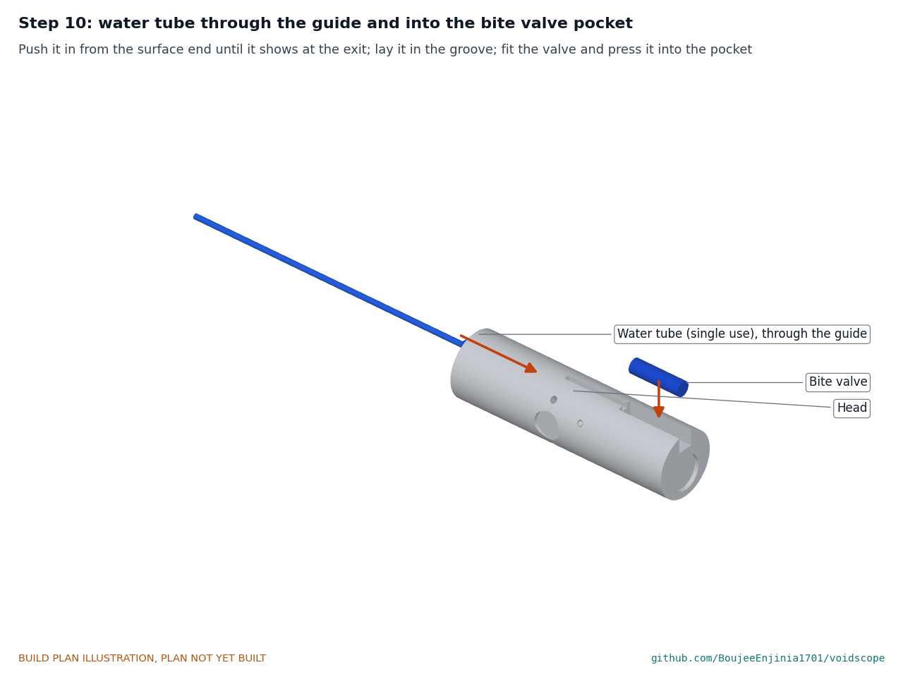

Slide each section forward along the lines and click it onto the one in front. The depth bands should run on in order. To store the probe, undo the joints and lay the sections side by side in the carry case, with the lines and housings in loose loops at least 150 mm across.

### Step 11: steering wires onto the drum; set the tip straight

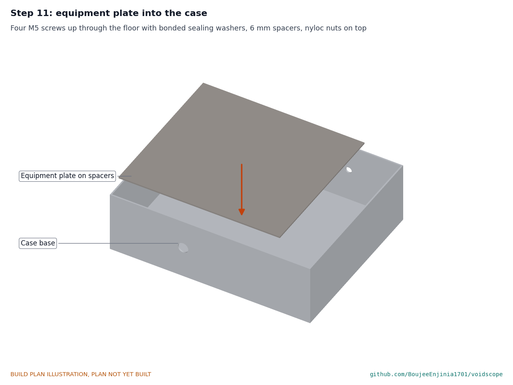

With the tip straight and the lever's place marked upright, take each wire up from its housing stop, wrap it once round its own groove on the drum (one from the front, one from the back) and clamp it with the groove's screw, taking up the slack by hand. Push the shaft through one cheek, the drum and the other cheek; fit the lever upright on the button-line side and the lock knob on the other. Turn the lever each way to its stop: the tip must bend 90° to each side and come back straight when the lever is upright.

### Step 12: water tube through the guide and into the bite valve pocket

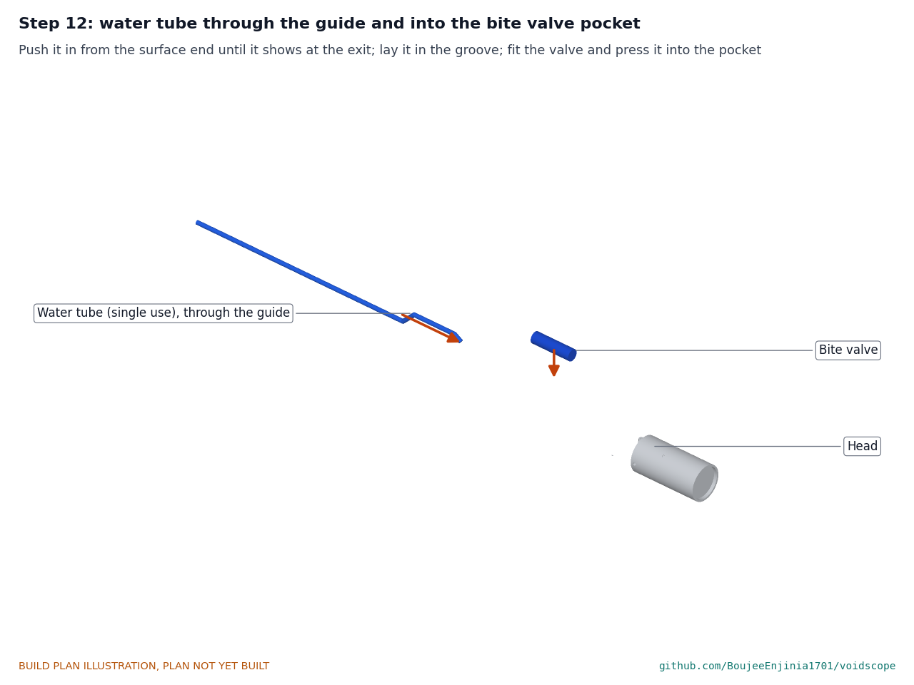

From the surface end, push a new water tube through the guide tube until it appears in the collar's air chamber; guide it up and out of the 45° exit with a bent wire, lay it in the top groove, fit the bite valve and press the valve into its pocket. Do this with clean gloves; the tube end must touch nothing but the valve.

### Step 13: equipment plate into the case

Four M5 screws up through the floor with bonded sealing washers outside, 6 mm nylon spacers inside, the plate on top, nyloc nuts.

### Step 14: battery, blower, modules and flow meter onto the plate

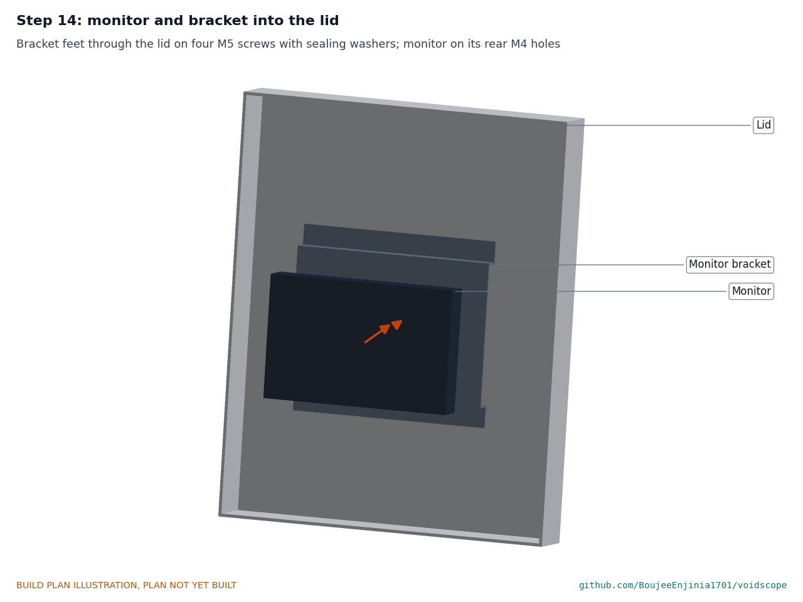

Fix each part to the plate; strap the battery. Wire them as Figure 25 shows, with the battery lead unplugged and the fuse out. Join the filter, blower, flow meter and outlet with short lengths of hose and hose clips.

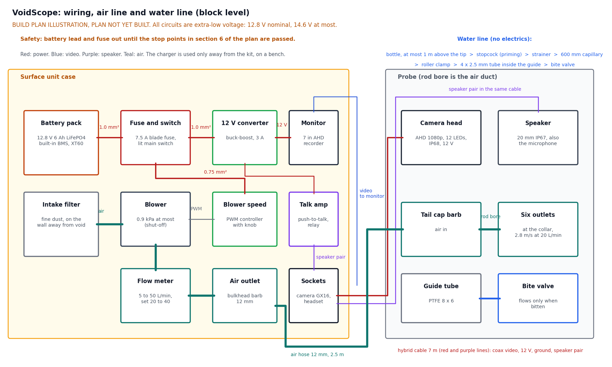

*Figure 25. Block-level wiring with wire sizes, and the air and water lines. All circuits are extra-low voltage.*

### Step 15: wall fittings and intake filter

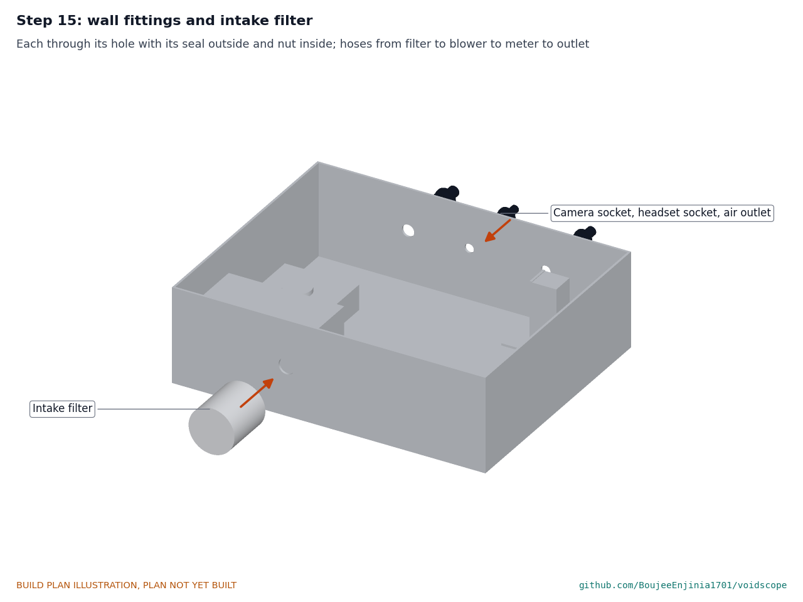

Fit the camera socket, headset socket and air outlet through the wall facing the probe, and the intake filter through the opposite wall, each with its seal outside and nut inside.

### Step 16: monitor and bracket into the lid

Bolt the bracket feet through the lid with four M5 screws and sealing washers; screw the monitor to the bracket; run its leads to the modules with enough slack for the lid to open fully.

### Step 17: set up at the hole

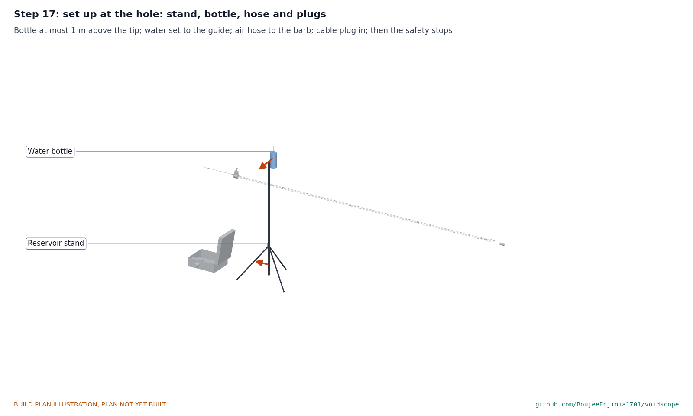

Stand the surface unit beside the hole with its lid toward the operator. Plug in the camera cable; join the air hose to the outlet and the tail cap barb; sleeve the hose and lines together. Hang the bottle on the stand no more than 1 m above the tip; join the water set from the bottle through the stopcock, strainer, capillary and roller clamp to the water tube. Steer the tip both ways on the monitor, then set the lever upright and tighten the lock knob so the tip is straight. Then work through the safety stops in section 6.

## 5. First checks

These are the checks a TRL 4 test report would record; this plan only lists them. Requirement numbers are those of VDS-REQ-001.

*Table 2. First checks.*

| Check | Requirement | How | Pass when |
| --- | --- | --- | --- |
| Core hole | R1 | With the tip locked straight, pass the assembled probe through a 51 mm ring from the tip back to the steering control | It passes without catching at the tip, head or buttons |
| Reach | R2 | Measure from the front of the grip to the tip, and from the front of the steering control to the tip | 4,000 mm or more from the grip; note the second figure |
| See around a bend | R11 | Test box: a 51 mm hole into a 300 mm wide passage that turns 45° 0.5 m beyond the hole; 20 mm letters 1 m down the turned passage. Push the probe in straight, steer, read; then the other side; straighten and withdraw | Letters read on the monitor to each side; the tip comes back out through the hole without catching |
| Steering | R11 and calculation note J | Lever to each stop; measure the tip angle and the thumb force; then lock and push the tip lightly | 85° to 90° each way; 10 N or less at the thumb; the lock holds the tip |
| Joints | Design loads | Pull each joint by hand, then hang a 30 kg (300 N) load from the tip with the probe vertical; twist each joint | Nothing moves; each button releases with one press |
| Picture | R3 | Dark box, 20 mm letters at 1 m, then with dust | Letters readable on the monitor and in the recording |
| Sealing | R4 | Head under 1 m of water for 30 min with the camera on | Picture stays clear; no water in the head |
| Water ceiling | R5 | Bottle at 1.0 m above the tip, clamp fully open, collect at the bite valve held open for 10 min | Between 1.2 and 1.8 mL/min at room temperature; none with the clamp shut or the valve not bitten |
| Air | R6 | Flow meter at 20 L/min; manometer at a blocked tip at full speed | 20 L/min reached; blocked-tip pressure 1.0 kPa or less |
| Battery | R7 | Run video and light from one full pack | 4 h or more at room temperature (the -10 °C run is a TRL 4 test) |
| Setup | R9 | Two people from closed cases to a picture | 3 min or less |
| Water set change | R10 | Pull the old tube, push a new one, prime | 5 min or less, no tools |
| Voice | R12 | Talk with a person at the tip in a noisy yard | Both understood without repeating |
| Handling | Calculation note B | Push 2 m into a box with the tip unsupported, then 3 m | Held steadily at 2 m; at 3 m the tip must rest on something |

## 5a. Drill card

A printed, laminated card kept in the lid of the surface unit. It is for drills with the team's medical lead; the plan does not cover real use on a person. Amish decided on 2026-10-03 (round 2, 3A) to keep the bite valve on the nose: "i agree with all the 46 recommendations you provided. please proceed." The card therefore carries this rule.

*Table 3. Drill card.*

| When | What to do |
| --- | --- |
| Before the tip goes in or out of a hole | Lever upright, lock knob tight, tip straight on the monitor (stop S9) |
| To give water | Only when the medical lead directs it (stop S7). **Steer the tip aside** with the lever, fully to one side, so the bite valve on the nose is the foremost part and the person can reach it. The camera then sits about 109 mm to the side and 51 mm ahead of the nose. Open the roller clamp from closed; the person bites the valve to drink |
| After giving water | Close the roller clamp, straighten the tip on the monitor, lock the lever, then carry on |
| Never | Force the lever past its stops; use the bent tip to move debris; give water to a person who cannot speak or drink |

Whether a survivor can reach the valve past the tip is confirmed in drills with the medical lead (design decisions register, to confirm item 14).

## 6. Safety stops

Stop at each point. Carry on only when everything listed is true.

- **S1. Before the lathe work.** Chuck key out of the chuck; work held firmly (the 6.5 mm offset in a four-jaw chuck is balanced); guards in place; safety glasses on; no gloves at the lathe.
- **S2. Before the battery is plugged in.** The fuse is out; with a meter, there is no short from the battery socket to ground; every wire end is crimped or soldered and covered; the polarity at the converter matches the pack.
- **S3. Before the fuse goes in.** The pack reads 12.8 to 13.6 V, is undamaged and is strapped down; the main switch is off.
- **S4. Before the blower runs on the probe.** With the outlet blocked by a gloved thumb, the blower at full speed cannot be felt pushing hard; a manometer at the outlet reads 1.0 kPa or less. The intake filter is fitted and faces away from any engine or smoke.
- **S5. Before water goes into the line.** The water set is new and sealed until now; the capillary and strainer are in the line; there is no pump, pressurised container or syringe connected to the bottle side; the bottle hangs no more than 1 m above the tip. Prime with the syringe through the stopcock only before the probe goes in, then turn the stopcock to the bottle and close the syringe port.
- **S6. Before the probe goes into any void, even in training.** The site's structural safety officer has cleared the work position; the operator stays outside the void and off unstable debris; the probe is never used as a lever.
- **S7. Before water is offered to a person (outside this plan; drills only).** The team's medical lead directs it; the person is conscious, can speak and can drink; the flow is set by the roller clamp from closed; the camera tip is steered aside so the bite valve can be reached (drill card, section 5a).
- **S8. Charging.** Packs are charged only on their own charger, away from the kit, on a non-combustible surface, never below 0 °C and never unattended on a first charge.
- **S9. Before the tip goes into or comes out of a hole.** The lever is upright, the lock knob is tight and the tip is straight on the monitor. Never force the lever past its stops, and never use the bent tip to move debris: the links are printed nylon.

## 7. Tools, skills and workspace

**Tools.** Online laser-sintering (SLS) print service for the bending links and the steering control body; metal lathe with a three-jaw and a four-jaw chuck, boring bar, parting tool and 1/4 BSP tap (or the machine shop allowance in the bill of materials); drill press with a vee block and a 45° vee block; drills 3 to 14 mm, step drill to 22 mm; small milling machine or a saw and files for the nose pocket and grooves; tube cutter or fine-tooth saw; deburring tool; M3 and M4 taps; 1.2 mm drill and a 2.0 mm reamer; ferrule crimping pliers and wire rope cutters; scriber, straight edge and calipers; sheet folder or vice with hardwood jaws for 2 mm sheet; heat gun; soldering iron, wire strippers and crimpers; multimeter; spirit level; manometer reading to 2 kPa; graduated cylinder (25 mL) and stopwatch; clamp stand.

**Skills.** Basic turning, drilling, tapping and light milling; bonding with structural epoxy; through-hole soldering and crimping; safe handling of lithium iron phosphate packs. No mains wiring is part of the build: the charger is a bought, certified unit.

**Workspace.** A bench about 2 m long so a section can lie flat; a metalwork corner kept apart from the electronics; a clean area for the water set; the charging spot of S8.

**Personal protective equipment.** Safety glasses for turning, drilling, cutting and soldering; nitrile gloves for epoxy and for handling the water set; hearing protection when cutting tube; no gloves near a turning chuck or drill.

## 8. Where the numbers come from

- Model and constructability checks: `cad/src/model.py` (`python cad/src/model.py --check`, 180 checks); STEP and STL exports in `cad/step/` and `cad/stl/`.
- Pictures: `cad/src/build_plan_media.py`, using `.kit/build_views.py`; written to `docs/05-build-plan/` and `cad/drawings/VDS-DWG-101` to `VDS-DWG-114`.
- General arrangement: `cad/drawings/VDS-DWG-001.pdf`, Rev P3.
- Calculations: `docs/04-calcs/01-sizing.md` (VDS-CAL-001 v0.2) and `docs/04-calcs/sizing.py`.
- Bill of materials: `bom/bom.csv`.
- Decisions: `docs/decisions/0003-steerable-camera-tip.md` (VDS-DDR-003) and `docs/decisions/0002-design-for-construction.md` (VDS-DDR-002), with VDS-DDR-001; register `docs/06-design-decisions.md`.
- Requirements: `docs/03-requirements.md` (VDS-REQ-001 v0.4).
